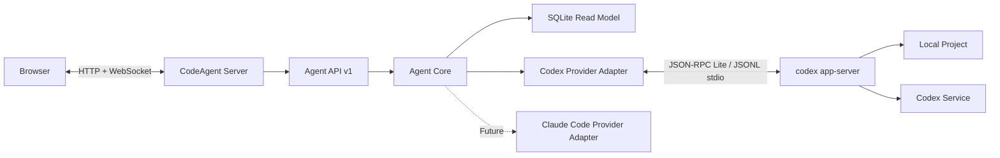
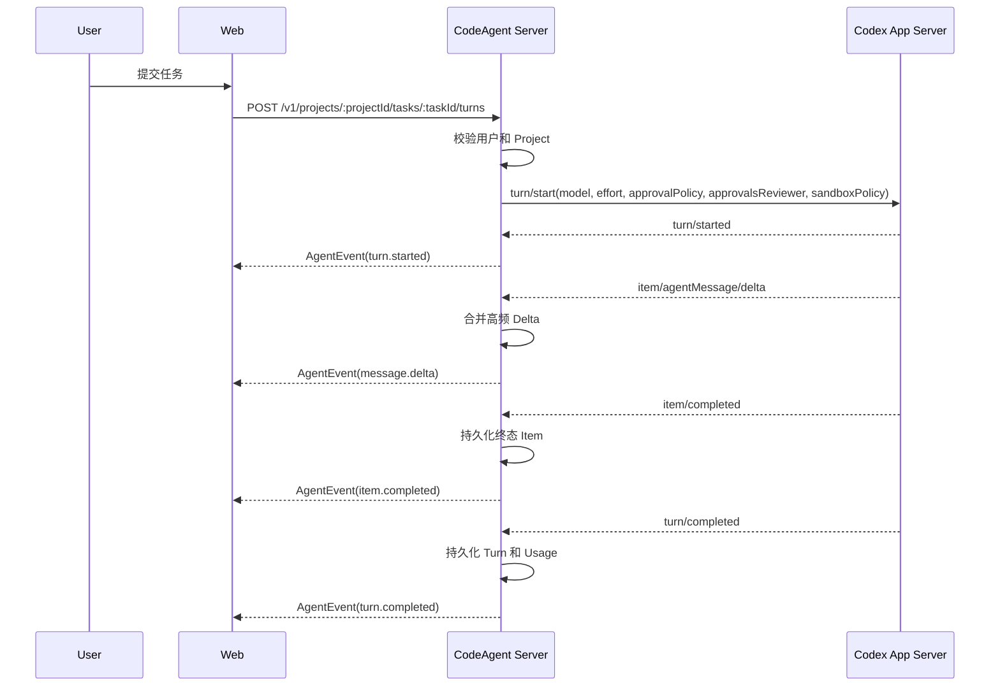

# CodeAgent 架构设计

> 状态：Draft  
> 更新日期：2026-07-29
> 目标版本：MVP  
> 文档类型：架构说明（Explanation）

## 1. 背景

CodeAgent 是一个通过 Web 操作本地 Coding Agent 的应用。第一阶段仅支持 Codex，底层调用 Codex CLI；后续允许接入 Claude Code 或其他 Agent Provider。

Web 页面、组件、浏览器状态和渐进式性能策略由 [Web 设计](./web-design.md) 进一步约束；与本文件中的 Web 概览冲突时，以该细化设计为准。

产品对用户只暴露一个 npm 包和一个 CLI 命令：

```bash
npx --package @bryanhu/code-agent@latest code-agent start
```

或全局安装后运行：

```bash
npm install -g @bryanhu/code-agent
code-agent start
```

用户先在官方 Codex CLI 中完成登录。命令启动后，用户直接在浏览器中完成 Project 选择、Task 管理、任务执行、审批、Diff 查看和中断操作。

## 2. 目标与非目标

### 2.1 目标

- 通过单一 npm 包提供开箱即用的 Web Codex App。
- 使用 Codex App Server 的结构化协议，不解析 TUI 文本。
- 向 Web 提供与 Provider 无关、可版本化的统一 API。
- 支持 Task、Turn、Item、流式输出、审批、Diff、Plan 和 Usage。
- 默认采用本地优先、安全收敛的运行方式。
- 在长会话、高频流式输出和多 Task 场景下保持稳定性能。
- 允许后续增加 Claude Code Provider，而不改写 Web 主流程。

### 2.2 非目标

MVP 不包含以下能力：

- 完整 IDE 或桌面应用替代品。
- 任意远程多租户 SaaS 部署。
- 浏览器内完整终端。
- 完整文件编辑器和 Git 客户端。
- MCP Server 管理、插件市场和 Skills 管理。
- Codex 账号登录、退出和凭证管理。
- 对所有 Provider 强制提供完全一致的能力。
- 兼容旧的自定义 CLI 文本解析实现。

## 3. 核心架构决策

### 3.1 只发布一个 npm 包

CodeAgent 只发布一个公开 npm 包：

```text
@bryanhu/code-agent
```

内部使用 pnpm workspace 和多个私有模块，但它们只用于维护、测试和构建，不单独发布。

该决策保证用户只需要理解一个安装入口和一个 CLI 命令，同时避免浏览器、服务端和 Provider 代码在源码层面相互耦合。

### 3.2 使用 Codex App Server 作为主接入层

富交互 Web 客户端需要历史、审批、流式事件、模型发现和配置读取，因此主接入层选择：

```text
codex app-server --listen stdio://
```

不采用以下方案作为主路径：

| 方案                 | 定位           | 不作为主路径的原因                         |
| -------------------- | -------------- | ------------------------------------------ |
| Codex TUI            | 终端交互       | 输出面向人类，无法形成稳定协议             |
| `codex exec --json`  | 一次性任务、CI | 生命周期较短，不适合完整审批和富客户端状态 |
| `@openai/codex-sdk`  | 服务端工作流   | 当前能力面小于 App Server                  |
| App Server WebSocket | 实验传输       | 官方仍标记为 experimental/unsupported      |

`codex exec --json` 可以保留为诊断工具或未来的一次性无状态任务路径。

### 3.3 浏览器不直接连接 Codex

浏览器只连接 CodeAgent Server。服务端负责：

- 启动和管理 Codex App Server 子进程。
- 处理 Codex JSON-RPC Lite 协议。
- 将 Codex 事件转换为统一 Agent Event。
- 校验 Project、Task 和审批权限。
- 提供快照、分页、断线恢复和持久化。

浏览器不得直接读取 `~/.codex`、调用 Codex RPC 或访问本地文件系统。

### 3.4 默认不启用实验 API

初始化 App Server 时默认不设置：

```json
{
  "capabilities": {
    "experimentalApi": true
  }
}
```

实验能力必须同时满足：

- Provider 能力检测通过。
- 配置显式启用。
- 存在稳定 API 的降级路径。
- 通过对应 Codex CLI 版本的契约测试。

### 3.5 内部统一使用 pnpm

项目内部统一使用 pnpm 管理依赖、Workspace、开发脚本和发布流程；用户侧仍推荐通过 `npx` 直接启动，不要求用户预先安装 pnpm：

```bash
npx --package @bryanhu/code-agent@latest code-agent start
```

仓库内部使用：

```text
pnpm install
pnpm dev
pnpm build
pnpm test
pnpm publish
```

根 `package.json` 必须通过 `packageManager` 固定 pnpm 版本，并提交唯一的 `pnpm-lock.yaml`。仓库不保留 `package-lock.json`、`npm-shrinkwrap.json` 或 `yarn.lock`，CI 使用 `pnpm install --frozen-lockfile` 保证依赖解析一致。

## 4. 总体架构


```mermaid
flowchart LR
    Browser["Browser"] <-->|"HTTP + WebSocket"| Server["CodeAgent Server"]
    Server --> API["Agent API v1"]
    API --> Core["Agent Core"]
    Core --> Store["SQLite Read Model"]
    Core --> CodexAdapter["Codex Provider Adapter"]
    Core -. Future .-> ClaudeAdapter["Claude Code Provider Adapter"]
    CodexAdapter <-->|"JSON-RPC Lite / JSONL stdio"| AppServer["codex app-server"]
    AppServer --> Project["Local Project"]
    AppServer --> CodexService["Codex Service"]
```

### 4.1 进程模型

本地单用户模式包含以下进程：

```text
Browser
  -> CodeAgent Node.js Process
       -> Fastify HTTP/WebSocket Server
       -> SQLite Database Worker
       -> codex app-server Child Process
```

默认每个 `CODEX_HOME` 只运行一个长驻 Codex App Server，并由该进程承载多个 Codex 原生 Thread；Adapter 将它们映射为公开 Task。不要为每个 Turn 创建新的 Codex 进程。

### 4.2 数据流


```mermaid
sequenceDiagram
    participant U as User
    participant W as Web
    participant S as CodeAgent Server
    participant C as Codex App Server

    U->>W: 提交任务
    W->>S: POST /v1/projects/:projectId/tasks/:taskId/turns
    S->>S: 校验用户和 Project
    S->>C: turn/start(model, effort, approvalPolicy, approvalsReviewer, sandboxPolicy)
    C-->>S: turn/started
    S-->>W: AgentEvent(turn.started)
    C-->>S: item/agentMessage/delta
    S->>S: 合并高频 Delta
    S-->>W: AgentEvent(message.delta)
    C-->>S: item/completed
    S->>S: 持久化终态 Item
    S-->>W: AgentEvent(item.completed)
    C-->>S: turn/completed
    S->>S: 持久化 Turn 和 Usage
    S-->>W: AgentEvent(turn.completed)
```

## 5. 仓库与构建结构

建议结构：

```text
code-agent/
  pnpm-workspace.yaml         # pnpm Workspace 范围
  pnpm-lock.yaml              # 唯一依赖锁文件
  apps/
    web/                     # React Web 应用
  packages/
    protocol/                # 统一类型、JSON Schema、OpenAPI
    core/                    # Provider 接口、状态机、调度器
    provider-codex/          # Codex 进程与协议适配
    server/                  # Fastify API 和持久化
    client/                  # Web 使用的轻量客户端
  src/
    cli.ts                   # CLI bin 入口
  docs/
    architecture-design.md
  package.json               # 唯一发布的 npm 包
```

`packages/*` 设置为 `private: true`。构建完成后只发布：

```text
dist/
  cli.js
  server/
  providers/
  protocol/
  web/
package.json
README.md
LICENSE
```

根 `package.json` 提供命令：

```json
{
  "name": "@bryanhu/code-agent",
  "type": "module",
  "packageManager": "pnpm@<pinned-version>",
  "bin": {
    "code-agent": "dist/cli.js"
  },
  "files": ["dist"],
  "engines": {
    "node": ">=24"
  }
}
```

文档和发布配置使用 npm 包名 `@bryanhu/code-agent`；唯一 CLI 命令保持 `code-agent`，不保留冗余兼容别名。

根 `pnpm-workspace.yaml` 至少包含：

```yaml
packages:
  - "apps/*"
  - "packages/*"
```

常用开发和发布命令：

```bash
pnpm install --frozen-lockfile
pnpm dev
pnpm build
pnpm test
pnpm publish
```

## 6. CLI 设计

### 6.1 命令

MVP 提供：

```bash
code-agent start
code-agent doctor
code-agent version
```

`start` 支持：

```bash
code-agent start --codex-home /path/to/codex-home
```

可选参数：

```text
--codex-bin <path>
--codex-home <path>
```

CLI 启动一个不绑定 Project 的全局 `codex app-server --listen stdio://`。Project 默认列表为空，由 Web 通过宿主系统目录选择器添加，并持久化到 `CODEX_HOME/code-agent/state.sqlite3`。

### 6.2 默认配置

```json
{
  "host": "127.0.0.1",
  "port": 3210,
  "openBrowser": true,
  "sandbox": "workspace-write",
  "approvalPolicy": "on-request",
  "approvalsReviewer": "user"
}
```

### 6.3 启动流程

```text
1. 加载 CLI 参数和配置文件。
2. 校验 Host、Port、Project 和数据目录。
3. 启动数据库 Worker 并应用 Migration。
4. 定位兼容的 Codex CLI。
5. 执行 Codex 版本检查。
6. 启动 codex app-server 子进程。
7. 完成 initialize / initialized 握手。
8. 读取模型和 Task 元数据。
9. 启动 Fastify HTTP/WebSocket Server。
10. 提供构建后的 React 静态资源。
11. 本地模式打开浏览器；LAN 模式只在终端输出物理网络接口上的私有 IPv4 URL。
12. 监听退出信号并执行有超时的优雅关闭。
```

`doctor` 至少检查：

- Node.js 版本。
- Codex CLI 是否可执行及版本是否兼容。
- `CODEX_HOME` 是否可访问。
- Project 是否存在、是否为目录、是否在允许范围内。
- 配置文件是否有效。
- 端口是否可用。
- SQLite 是否可写、Migration 是否完整、`integrity_check` 是否通过。
- SQLite 是否启用 WAL、外键、NORMAL synchronous 和 5000ms busy timeout。

## 7. Codex CLI 分发策略

为了保证一条命令可启动，并降低协议漂移风险，默认通过 pnpm 将 `@openai/codex@0.146.0` 固定为生产依赖。

Codex Binary 查找顺序：

```text
1. --codex-bin
2. CODE_AGENT_CODEX_BIN
3. CodeAgent 包内固定版本的 @openai/codex
4. PATH 中的 codex
```

默认优先使用包内固定版本。只有显式配置时才使用外部 Codex Binary。

即使使用包内 Codex，也继续复用用户的 `CODEX_HOME`，从而共享：

```text
~/.codex/config.toml
~/.codex/auth.json
~/.codex/sessions
~/.codex/skills
```

用户必须使用相同 `CODEX_HOME` 在官方 Codex CLI 中完成登录。认证文件只由 Codex CLI 和 App Server 消费；CodeAgent 不读取、修改或复制认证文件，也不调用 App Server Account API。

## 8. Provider 抽象

### 8.1 设计原则

- Web 不感知 Codex RPC 名称。
- 不以 `sendMessage()` 作为唯一抽象。
- 使用能力协商表达 Provider 差异。
- 通用字段保持稳定，专有字段放入 `extensions`。
- 不模拟 Provider 原本不支持的行为。

### 8.2 Provider 接口

```ts
export interface AgentProvider {
  readonly id: string;

  getCapabilities(): Promise<ProviderCapabilities>;
  listModels(): Promise<AgentModel[]>;
  listSkills(): Promise<AgentSkill[]>;
  listTasks(input: ListTasksInput): Promise<Page<AgentTask>>;
  readTask(input: ReadTaskInput): Promise<AgentTask>;
  startTask(input: StartTaskInput): Promise<AgentTask>;
  resumeTask(input: ResumeTaskInput): Promise<AgentTask>;
  renameTask(input: RenameTaskInput): Promise<void>;
  archiveTask(input: ArchiveTaskInput): Promise<void>;
  startTurn(input: StartTurnInput): Promise<AgentTurn>;
  steerTurn(input: SteerTurnInput): Promise<void>;
  interruptTurn(input: InterruptTurnInput): Promise<void>;
  resolveRequest(input: ResolveRequestInput): Promise<void>;

  // 所有 Provider 事件必须先转换为统一事件，再交给上层消费。
  events(): AsyncIterable<AgentEvent>;
}
```

### 8.3 能力模型

```ts
export interface ProviderCapabilities {
  tasks: {
    list: boolean;
    read: boolean;
    start: boolean;
    fork: boolean;
  };
  turns: {
    start: boolean;
    interrupt: boolean;
    rollback: boolean;
    review: boolean;
    compact: boolean;
  };
  feedback: {
    upload: boolean;
  };
  skills: {
    list: boolean;
    use: boolean;
  };
}
```

Web 根据能力决定是否展示 Fork、Steer、Approval、Plan 等控件，而不是根据 Provider 名称写条件分支。

### 8.4 Agent 输入 API

Agent Actions 使用 Provider 无关的模型、附件和写入端点：

```text
GET  /v1/models
GET  /v1/projects/:projectId/skills
GET  /v1/projects/:projectId/tasks/:taskId/attachments/:attachmentId
POST /v1/projects/:projectId/attachments/:kind
POST /v1/projects/:projectId/tasks
POST /v1/projects/:projectId/tasks/:taskId/turns
POST /v1/projects/:projectId/tasks/:taskId/turns/:turnId/interrupt
POST /v1/projects/:projectId/tasks/:taskId/review
POST /v1/projects/:projectId/tasks/:taskId/compact
POST /v1/projects/:projectId/tasks/:taskId/fork
POST /v1/projects/:projectId/tasks/:taskId/feedback
```

所有写请求必须携带非空 `Idempotency-Key`。Server 以操作、资源和 Key 共同确定幂等范围：相同 Payload 复用进行中或成功结果，不同 Payload 返回 `IDEMPOTENCY_CONFLICT`，失败结果允许同 Key 重试。

新上传图片、文件与生成文本通过 `multipart/form-data` 二进制流进入有容量和过期时间限制的 Server Store，附件类型由 `:kind` 路径参数在解析 Body 前确定。Server 先按 `Content-Length` 拒绝明显超限请求，再按流式字节数强制执行单附件限制；所有类型均使用异步文件 API 写入 Runtime 隔离临时目录，内存不长期保留 Base64。浏览器只获得随机附件 ID。Turn 启动前 Server 才按需将图片临时解析为 Provider Data URL、将普通文件解析为临时路径；Provider 分别映射为 Codex `image` 与 `mention`，粘贴文本映射为带 UTF-8 `text_elements` 范围的 `text`。成功后消费图片和文本引用，普通文件保留到 Turn 终态，失败时保留引用供重试。历史图片和粘贴文本采用独立的 Provider 授权记录；Provider 将 `text_elements` 恢复为附件并从用户可见正文剔除，Task Snapshot 只返回 `{ id, kind, mediaType, name, size }`。浏览器通过 Project/Task 作用域 GET 端点按需读取正文，Server 不再次重建 Snapshot，也不暴露 Codex 本地路径。`GET /v1/models` 直接映射 Provider 模型目录及其默认、可用思考量，页面不得把硬编码模型或思考量作为成功态数据。`GET /v1/projects/:projectId/skills` 返回当前 Project 的统一 Skill 目录，只包含不透明 ID 和展示元数据；原生路径不得进入 HTTP 契约。

`turn/interrupt` 只返回 `{ status: "interrupting", taskId, turnId }`；Turn 是否真正中断由后续 `turn.completed` 事件决定。错误统一映射为 Protocol 定义的 `{ code, message, retryable }`，不得向 Web 暴露原生 RPC 细节。

### 8.5 Project 文件 API

Inspector 通过以下只读端点获取受限文件树：

```text
GET /v1/projects/:projectId/files/tree
GET /v1/projects/:projectId/files/tree?path=src/components
```

Server 固定从已注册 Project 的根目录解析可选的 Project 相对目录，每次返回目标目录 `path` 与其直接目录/文件条目，不设置条目数量上限。目录解析沿根目录逐层应用 Project 内任意层级的 `.gitignore`，不依赖根目录是否为 Git 仓库或是否存在根级规则；同时跳过符号链接、`.git`、`node_modules`、构建和覆盖率目录，并限制为 `20` 层。`path` 必须通过严格 Schema 校验，拒绝绝对路径、点路径、反斜杠和额外字段，不能透传任意文件系统路径。

AI 回复中的本地文件引用通过以下受认证只读端点打开：

```text
GET /v1/projects/:projectId/files/source?path=:path
```

Server 必须先验证 Project。相对引用从 Project 根目录解析，并通过 `realpath` 包含关系拒绝逃逸路径和越界符号链接；显式绝对引用直接解析本机真实路径，允许读取 Project 外的可读普通文件。响应返回解析后的相对或绝对路径、文本预览与 `truncated`，拒绝目录和二进制内容，单次最多读取 `256 KiB`、最多返回 `4,000` 行；图片引用同样允许显式绝对路径，但继续校验普通文件、`20 MiB` 上限和 GIF、JPEG、PNG、WebP 内容签名。Web 在弹窗中显示路径、行号、目标行和截断状态。

## 9. 统一领域模型

### 9.1 核心实体

```text
ProviderAccount
Project
AgentTask
AgentTurn
AgentItem
PendingRequest
Usage
AgentEvent
```

Task、Turn、Item 保留 Codex 原始 Thread、Turn、Item 的层级，但不把 Provider 命名暴露给 Web：

```text
AgentTask
  -> AgentTurn[]
       -> AgentItem[]
```

不要将命令、文件变更、推理和审批全部压平成普通聊天消息。

### 9.2 事件信封

```ts
export type AgentEvent = {
  version: 2;
  sequence: number;
  timestamp: string;
  provider: string;
  sessionId: string;
  taskId?: string;
  turnId?: string;
  itemId?: string;
  type: AgentEventType;
  payload: unknown;
  extensions?: Record<string, unknown>;
};
```

Realtime Path 当前实现的 v2 判别类型与 payload：

| `type`                 | 必需定位字段                 | `payload`                                    |
| ---------------------- | ---------------------------- | -------------------------------------------- |
| `turn.started`         | `taskId`, `turnId`           | `{ turn: AgentTurn }`                        |
| `message.delta`        | `taskId`, `turnId`, `itemId` | `{ delta: string }`                          |
| `reasoning.delta`      | `taskId`, `turnId`, `itemId` | `{ delta, field: "summary" \| "content" }` |
| `command.output_delta` | `taskId`, `turnId`, `itemId` | `{ delta: string }`                          |
| `item.started`         | `taskId`, `turnId`, `itemId` | `{ item: AgentItem }`                        |
| `item.completed`       | `taskId`, `turnId`, `itemId` | `{ item: AgentItem }`                        |
| `turn.completed`       | `taskId`, `turnId`           | `{ turn: AgentTurn }`                        |
| `provider.error`       | `taskId`, `turnId`           | `{ message, willRetry }`                     |
| `pending_request.created` | `taskId`, `turnId`, `itemId` | `{ request: PendingRequest }`             |
| `pending_request.resolved` | `taskId`, `turnId`, `itemId` | `{ request: PendingRequest }`            |
| `pending_request.expired` | `taskId`, `turnId`, `itemId` | `{ request: PendingRequest }`              |

Provider 只产生不含传输字段的统一事件，并仅发布已通过当前 Project 归属验证的 Task。Server 在 Runtime Session 内统一补齐 `version`、`provider`、`sessionId`、`sequence` 和 `timestamp`。

事件约束：

- `sequence` 在一个 Runtime Session 内单调递增。
- 同一个 Item 的 Delta 保持到达顺序。
- `item.completed` 和 `turn.completed` 是最终权威状态。
- 未知 Provider 事件只记录告警，不中断事件循环。
- 原始 Provider 数据只允许进入诊断字段。
- Approval、Terminal State 和 Error 事件不可丢弃。

## 10. Agent API v1

### 10.1 HTTP API

```text
GET    /v1/health
GET    /v1/capabilities
GET    /v1/providers
GET    /v1/models
GET    /v1/projects
POST   /v1/projects
POST   /v1/projects/:projectId/attachments/:kind
GET    /v1/projects/:projectId/files/source
GET    /v1/projects/:projectId/tasks
POST   /v1/projects/:projectId/tasks
GET    /v1/projects/:projectId/tasks/:taskId
POST   /v1/projects/:projectId/tasks/:taskId/fork
POST   /v1/projects/:projectId/tasks/:taskId/turns
POST   /v1/projects/:projectId/tasks/:taskId/turns/:turnId/interrupt
POST   /v1/projects/:projectId/tasks/:taskId/pending-requests/:requestId/resolve
```

所有可能重试的写操作支持：

```http
Idempotency-Key: <uuid>
```

`GET /v1/projects/:projectId/tasks/:taskId` 返回 Snapshot 与同一 Project Event Stream 的恢复检查点：

```json
{
  "snapshot": { "id": "task-id", "pendingRequests": [], "turns": [] },
  "checkpoint": { "sessionId": "runtime-session-id", "sequence": 1024 }
}
```

Provider 在 `readTask` Promise 完成前让返回 Snapshot 包含此前状态并同步交付对应 Notification；Server 在 Snapshot 读取完成后捕获 checkpoint，保证事件既不会丢失，也不会对已有内容再次补发。

### 10.2 WebSocket API

```text
WS /v1/projects/:projectId/events?afterSequence=<sequence>
```

连接建立后的第一条服务端消息包含：

```json
{
  "type": "connection.ready",
  "version": 1,
  "sessionId": "runtime-session-id",
  "latestSequence": 1024
}
```

每个 Project 的 Server 事件历史使用固定环形缓冲区，最多保留 `1,000` 条、合计 `4 MiB` 的事件，单事件最多保留 `1 MiB`。Server 按事件序列化后的 UTF-8 字节数从最旧事件开始淘汰；单事件超限时不进入历史，并记录不可连续回放的 Sequence 边界。

如果 `afterSequence` 跨越已淘汰或因单事件超限而未保留的序列，或大于当前 Session 的最新序号，服务端发送控制帧并要求刷新 Snapshot：

```json
{
  "type": "resync.required",
  "version": 1,
  "sessionId": "runtime-session-id",
  "latestSequence": 1024,
  "reason": "event_retention_exceeded"
}
```

`reason` 当前为 `event_retention_exceeded`、`session_changed` 或客户端检测生成的 `sequence_gap`。
服务端发送 `resync.required` 后关闭当前连接，客户端刷新 Snapshot 并使用新 checkpoint 建立连接。

客户端恢复流程：

```text
1. 记录最后处理的 sequence。
2. 断线后重新请求 Task Snapshot。
3. 使用 afterSequence 建立事件连接。
4. 服务端补发仍在保留窗口内的事件。
5. 若事件已过期，服务端要求客户端重新获取完整 Snapshot。
```

## 11. Codex Provider Adapter

### 11.1 子进程启动

推荐启动参数：

```text
codex app-server --listen stdio://
```

Node.js 必须使用参数数组和 `shell: false`：

```ts
const child = spawn(codexBin, ["app-server", "--listen", "stdio://"], {
  cwd: runtimeCwd,
  shell: false,
  stdio: ["pipe", "pipe", "pipe"],
  env: createCodexEnvironment(),
});
```

不得把 Token、API Key 或其他 Secret 放进参数数组。

### 11.2 连接握手

```text
initialize
initialized
model/list
thread/list
```

`model/list` 必须处理游标直到完成，过滤隐藏模型并保留 `isDefault`、`defaultReasoningEffort` 和 `supportedReasoningEfforts`；重复游标、空能力或不受支持的默认思考量按 Provider 协议错误处理。

`clientInfo` 使用稳定标识：

```json
{
  "clientInfo": {
    "name": "code_agent",
    "title": "CodeAgent",
    "version": "<package-version>"
  }
}
```

### 11.3 RPC 关联

Adapter 维护：

```text
request id -> pending Promise
server request id -> pending approval
provider thread id -> subscription state
turn id -> runtime state
```

所有 Pending RPC 都必须设置合理超时。进程退出时统一 Reject，避免 Promise 和 Listener 泄漏。

### 11.4 Task 与 Turn 映射

| Agent Core      | Codex App Server  |
| --------------- | ----------------- |
| `startTask`     | `thread/start`    |
| `resumeTask`    | `thread/resume`   |
| `forkTask`      | `thread/fork`     |
| `listTasks`     | `thread/list`     |
| `readTask`      | `thread/read`     |
| `archiveTask`   | `thread/archive`  |
| `renameTask`    | `thread/name/set` |
| `pinTask`       | `thread/metadata/update` |
| `startTurn`     | `turn/start`      |
| `steerTurn`     | `turn/steer`      |
| `interruptTurn` | `turn/interrupt`  |
| `startReview`   | `review/start`    |

Server 内部生成提交消息时调用 `startTask({ ephemeral: true })`。Server 已在校验 Snapshot 时取得选中变更：完整 Git diff 不超过 `64 KiB` 时，将带 staged/unstaged 标识的精确 diff 直接放入 Prompt；超过预算时改为有界的逐文件统计摘要，并从整个选择范围等距抽取最多 16 个变更，提供首尾 diff 片段。两种输入都禁止 Codex 再读取文件或运行命令，避免文件数量放大工具调用和延迟。发送给 Codex 的固定默认指令使用英语，用户配置的全局提交提示词保持原文且不翻译。默认 Prompt 不预设 Conventional Commits 或提交信息语言；没有全局提交提示词时只补充祈使语气、简洁标题和正文说明动机的通用质量规则，全局提交提示词负责定义客户级格式和语言。临时 Thread 不持久化、不进入 `listTasks` 回退，结束后只取消订阅。

`startTurn` 将统一 Prompt 映射为 Codex `UserInput[]`：已选择 Skill 使用 `{ type: "skill", name, path }`，非空文本使用 `text`，Server 已验证的图片 Data URL 使用 `image`，受控临时文件使用 `{ type: "mention", name, path }`。Skill 目录由 Project Provider 调用 `skills/list { cwds: [project.rootPath] }` 获取；Web 只接收稳定不透明 ID，Provider 在提交时重新验证 ID 与名称并解析原生绝对路径。统一 `model`、`reasoningEffort`、`approvalPolicy` 和 `approvalsReviewer` 分别映射为 Codex `model`、`effort`、`approvalPolicy` 和 `approvalsReviewer`，不向 Web 暴露其他原生字段。自动审批固定映射为 `approvalPolicy: "on-request"` 与 `approvalsReviewer: "auto_review"`；`never` 只表示从不询问，不能替代自动审核。

`startReview` 在调用 `review/start` 前记录统一 `AgentReviewTarget`，将响应、实时通知和历史 Snapshot 中的 `enteredReviewMode` 归一为稳定的 `AgentReviewItem`，并过滤 Codex 自动生成的内部 `userMessage` Review Prompt。Web 只根据结构化 Target 生成固定审查请求文案，不展示或复制 Provider 原生 Prompt。

`readTask` 映射 Codex 历史 `image` 与 `localImage` 时只写入随机附件 ID、媒体类型、名称和字节数。Provider 历史附件 Store 默认最多保留 `1,500` 个条目、合计 `512 MiB`、TTL `30` 分钟；本地图片只读取固定长度签名头，完整正文延迟到 `readTaskAttachment`，并在交付前复验文件身份和内容签名。Snapshot 重建与 `unsubscribeTask` 都清理对应 Task 的旧授权记录。

Task 列表和 Snapshot 直接将 Codex `Thread.isPinned` 映射为统一 `pinned`。固定或取消固定调用 `thread/metadata/update`，Provider 校验响应 Thread ID、Project `cwd` 与目标状态后返回权威 Task；Server 不覆盖该值，也不保存本地副本。

MCP Inspector 使用 `config/read { cwd: project.rootPath }` 获取当前 Project 的生效 `mcp_servers`，过滤禁用项后只交付名称。`mcpServerStatus/list` 在无 `threadId` 时只有进程级作用域，携带未加载 Thread 时不可用，因此单 App Server 多 Project 架构不使用它替代项目配置查询，也不为检查器创建或恢复 Thread。

### 11.5 事件映射

| Codex Event                         | Agent Event                 |
| ----------------------------------- | --------------------------- |
| `thread/started`                    | `task.started`              |
| `thread/status/changed`             | `task.status_changed`       |
| `turn/started`                      | `turn.started`              |
| `turn/completed`                    | `turn.completed`            |
| `turn/diff/updated`                 | `turn.diff_updated`         |
| `turn/plan/updated`                 | `turn.plan_updated`         |
| `item/started`                      | `item.started`              |
| `item/agentMessage/delta`           | `message.delta`             |
| `item/reasoning/summaryTextDelta`   | `reasoning.delta`           |
| `item/reasoning/textDelta`          | `reasoning.delta`           |
| `item/commandExecution/outputDelta` | `command.output_delta`      |
| `item/fileChange/patchUpdated`      | `file_change.patch_updated` |
| `item/completed`                    | `item.completed`            |
| `thread/tokenUsage/updated`         | `usage.updated`             |
| `error`                             | `provider.error`            |

`usage.updated` 使用 `last.totalTokens` 与 `modelContextWindow` 生成统一 `AgentContextUsage`，Runtime Reducer 实时更新，Provider 在后续 `AgentTaskSnapshot.contextUsage` 中恢复最近值；累计 `total.totalTokens` 仅表示账单累计量，不用于上下文占用。

### 11.6 审批映射

需要处理的服务端请求：

```text
item/commandExecution/requestApproval
item/fileChange/requestApproval
item/tool/requestUserInput
```

统一转换为：

```ts
export type PendingRequest = {
  requestId: string;
  projectId: string;
  taskId: string;
  turnId: string;
  itemId: string;
  type: "command_approval" | "file_change_approval" | "user_input";
  status: "pending" | "resolved" | "expired";
  createdAt: string;
  expiresAt: string | null;
};
```

各判别分支分别携带命令、文件授权根或结构化问题，不向 Web 暴露原生 JSON-RPC Payload。命令审批遇到 `networkApprovalContext` 时，将目标 Host 与协议归一化为 `networkAccess`，Web 必须按网络授权展示，不能依赖可能为空的命令文本。只有已通过当前 Project 归属验证的 Task 请求可进入解决集合；读取期间到达的请求先暂存，验证失败后直接丢弃。

解决请求统一调用 `POST /v1/projects/:projectId/tasks/:taskId/pending-requests/:requestId/resolve`，携带 `Idempotency-Key` 并完整校验 `projectId + taskId + turnId + itemId + requestId`、请求类型和状态。收到 `serverRequest/resolved`、Turn 完成或 Turn 中断后，必须发布一次 `pending_request.expired` 并清理相应请求；本地解决发布 `pending_request.resolved`。

### 11.7 外部登录边界

CodeAgent 不实现账号登录、退出、Device Code、OAuth 回调或凭证管理。用户在官方 Codex CLI 中通过 `codex login` 完成登录，CodeAgent 启动的 App Server 只复用相同 `CODEX_HOME` 中的状态。

Runtime 因凭证或其他 Provider 原因不可用时，Server 返回统一 Provider 错误；Web 展示 `codex login` 恢复指引和重试操作，不发起 Account API 请求，也不读取、修改或复制 `auth.json`。

## 12. 持久化设计

### 12.1 数据来源

Codex 已经持久化原生 Thread、Session 历史和 Task 固定状态。CodeAgent 不重复保存这些数据，只保存 Project 及其用户排序、全局 Agent 与提交消息设置、Project 新 Task 默认模型设置和 Task 完整设置。浅色/深色模式仅由浏览器本地保存，不进入 Server 数据库。

### 12.2 表结构

当前数据库包含：

```text
schema_migrations
projects
global_settings
project_defaults
task_settings
```

所有业务表使用 `STRICT`。`projects.sort_order` 保存 Sidebar 用户顺序；`global_settings` 保存全局审批、Agent 模型组合、提交消息模型组合、提交提示词、沙盒模式和默认打开应用；`project_defaults` 保存 `model`、`reasoning_effort` 和 `sandbox_mode`；`task_settings` 保存 `approval_policy`、`approvals_reviewer`、`model`、`reasoning_effort` 和 `sandbox_mode`。Project 与 Task 设置以 Project 外键隔离，Task 固定状态由 Codex Thread 持久化。

### 12.3 写入规则

- Project 和完整设置对象使用显式 SQL、Prepared Statement、事务和原子 upsert。
- Project 重排通过 `PUT /v1/projects/order` 提交无重复的完整 ID 集合；Server 校验没有遗漏或未知 Project 后，在 Database Worker 的单个事务中替换 `sort_order`。新注册 Project 使用当前最大顺序追加到末尾。
- Provider `/v1/models` 是模型目录真相源；数据库只保存 Agent 及提交消息使用的模型与思考量 ID。读取 Snapshot、设置 API、启动 Turn 和生成提交消息前均重新校验，无效组合按模型 ID 和 Provider 默认值确定性回退。
- 新 Task 从 Project 默认值继承 `model`、`reasoningEffort` 和 `sandboxMode`，`approvalPolicy` 固定从 `on-request` 开始，`approvalsReviewer` 固定从 `user` 开始。
- Task 固定、重命名和归档都不在本地复制 Codex 状态，分别调用 `thread/metadata/update`、`thread/name/set` 与 `thread/archive`。
- `allow_for_session`、可操作 Pending Approval 和模型目录不持久化；进程重启后不能恢复为可操作 `pending`。

### 12.4 SQLite 模式

本地模式采用：

```text
SQLite WAL
better-sqlite3
Dedicated Database Worker
foreign_keys = ON
synchronous = NORMAL
busy_timeout = 5000
```

同步 SQLite 调用不得运行在 Fastify 主事件循环中。独立 `worker_threads` Worker 负责数据库初始化、Migration、查询、事务和诊断，Fastify 只通过 Core Repository 端口异步调用 Adapter。

## 13. 高性能设计

### 13.1 性能原则

- 长驻进程优先于重复启动。
- 流式 Delta 与持久终态分离。
- 高频事件合并，关键事件不丢弃。
- 使用快照和分页，不一次加载完整历史。
- 浏览器使用归一化状态和有界历史窗口，达到明确性能阈值后再启用虚拟列表。
- 慢客户端不能阻塞 Provider 和其他客户端。

### 13.2 事件合并

以下事件允许在短时间窗口内合并：

```text
message.delta
command.output_delta
reasoning.delta
```

建议合并窗口为 16-50ms，最多每个动画帧触发一次 React 状态更新。

以下事件禁止丢弃或覆盖：

```text
approval.requested
approval.resolved
item.completed
turn.completed
provider.error
```

### 13.3 有界队列与反压

每个 WebSocket 客户端具有独立的有界发送队列。达到阈值时：

```text
1. 合并尚未发送的同类 Delta。
2. 丢弃已经被终态快照覆盖的旧 Delta。
3. 保留 Approval、Error 和 Terminal State。
4. 超过硬限制后断开慢客户端，要求其重新获取 Snapshot。
```

App Server 返回错误码 `-32001` 时，Adapter 使用带 jitter 的指数退避，不进行同步密集重试。

### 13.4 前端性能

- MVP 使用 AI Elements Conversation；达到长历史性能阈值后将 Timeline 内部替换为 `react-virtuoso`。
- 使用 Normalized Store，以 ID 关联实体。
- 每个 Item 独立订阅，避免整个 Task 重渲染。
- Markdown 只重新解析当前流式消息。
- 子代理详情只在用户打开弹窗时按 receiver Task ID 读取独立 Snapshot 并建立实时订阅；关闭弹窗立即卸载该 Runtime，再次打开时从最新 checkpoint 恢复，不能中断后台子代理或把完整子线程复制进父 Tool Item。
- 代码高亮延迟到代码块稳定后执行。
- Diff 使用 `turn/diff/updated` 的完整快照，不自行拼接历史 Patch。
- `@pierre/diffs` 仅在用户打开 Diff 时动态加载。

### 13.5 建议性能目标

| 指标                   | 目标                           |
| ---------------------- | ------------------------------ |
| 中层事件附加延迟       | `p95 < 20ms`                   |
| 收到 Delta 到页面更新  | `p95 < 100ms`                  |
| WebSocket 重连恢复     | `p95 < 1s`，不含 Provider 重连 |
| 打开 Task 元数据列表 | `p95 < 300ms`                  |
| 进程稳定性             | 连续运行 24 小时无明显内存增长 |
| 长历史渲染             | DOM 节点维持在可视区规模       |

这些是工程验收目标，不是对 Codex 上游响应时间的承诺。

## 14. 安全设计

### 14.1 默认网络边界

- `code-agent start` 默认只监听 `127.0.0.1:3210` 并自动打开浏览器，不启用配对；只有显式 `code-agent start --lan [--session-ttl <duration>]` 才监听 `0.0.0.0:3210`。LAN 模式不自动打开浏览器，终端只列出物理网络接口上的私有 IPv4 URL。
- LAN 模式是可信局域网内的明文 HTTP 便利能力，不提供 TLS、远程身份、账号、RBAC 或互联网暴露保护。配对码和 Session Cookie 会在网络中明文传输，只能在用户信任的网络中使用。
- LAN 启动时以 `node:crypto` 生成至少 128 bit 熵的配对码，只写当前终端并通过进程内参数传入 Server；不得进入 URL、环境变量、结构化日志、浏览器存储或 SQLite。进程重启后旧配对码和全部 Session 失效。
- 配对成功签发至少 256 bit 随机 Session ID，服务端只保存在有界进程内 Store；Cookie 固定使用 `HttpOnly; SameSite=Strict; Path=/`。目标是 HTTP，因此不设置会阻止 Cookie 发送的 `Secure`。
- Session 默认绝对有效 `24h`，`--session-ttl` 只接受 `1m` 至 `30d` 的整数 `m`、`h`、`d` 时长。有效期在签发时固定，请求不续期；注销删除当前 Session，Server 关闭清空全部 Session、失败窗口和定时器。
- 匿名范围仅包含静态 SPA、`GET /v1/health`、`GET /v1/access` 和 `POST /v1/access/pair`。其余 `/v1/*`、附件、源码、指标、Mutation 与 WebSocket Upgrade 全部由 Fastify 根级 Hook 认证。
- 配对失败按远端 IP 每分钟最多 5 次，并使用有界失败窗口；错误响应保持通用。Cookie 写请求和所有 WebSocket Upgrade 必须严格校验 `Origin` 与 `Host` 同源，不启用 CORS。
- 所有 `/v1/*` 响应使用 `Cache-Control: no-store`；应用响应设置 CSP、`X-Frame-Options: DENY`、`X-Content-Type-Options: nosniff`、`Referrer-Policy: no-referrer` 和受限 `Permissions-Policy`，HTTP 模式不设置 HSTS。

### 14.2 Project 与本机文件边界

每次 HTTP 和 WebSocket 操作都必须检查 Project 权限。文件树、Git、回滚及普通 Project 菜单路径始终限制在 Project 根目录内。

Project 相对路径校验流程：

```text
1. 将用户输入转换为绝对路径。
2. 解析 realpath。
3. 解析允许根目录的 realpath。
4. 执行路径包含关系校验。
5. 拒绝通过 ..、符号链接或大小写差异逃逸的路径。
```

不能仅在页面选择 Project 时校验一次。

AI 回复中的显式绝对文件引用属于受认证的本机只读能力，不执行 Project 包含关系校验；Server 必须对目标执行 `realpath`，确认文件存在、可读且类型受对应预览器支持，并继续执行大小、二进制内容和图片签名限制。宿主应用打开只允许真实文件或目录，并使用 `shell: false` 和参数数组执行。

### 14.3 禁止直接暴露的能力

MVP 不向 Web 暴露：

```text
thread/shellCommand
fs/remove
fs/writeFile
process/spawn
command/exec
任意 JSON-RPC 透传
```

其中 `thread/shellCommand` 是 Codex 原生 RPC，不继承 Codex Thread Sandbox，而是以 Full Access 执行，不能作为普通聊天功能开放。

### 14.4 Secret 管理

- 不把 API Key 放入命令行参数。
- 不把 Secret 写入普通日志。
- 不把 Token 返回给 Web。
- 不通过项目可控环境变量传递平台密钥。
- 不调用 App Server Account API，不读取、修改或复制 Codex 认证文件。
- 日志和诊断包必须执行字段级脱敏。

### 14.5 审批权限

审批操作必须同时校验：

```text
runtime access principal
provider runtime
task ownership
turn identity
pending request identity
request status
```

审批结果写入 Audit Log，记录访问主体、决定、时间、请求摘要和最终状态。

### 14.6 远程部署

未来支持远程多用户时，不能让多个不互信用户共享一个宿主机 Codex 进程。

每个用户或 Project 至少需要：

```text
独立 OS UID 或容器
独立 CODEX_HOME
独立 Project Volume
CPU/Memory/Process 限额
网络访问策略
独立 Secret 注入
运行超时和回收策略
```

## 15. 故障处理

### 15.1 Codex 子进程退出

```text
1. 标记 Provider Runtime 为 unavailable。
2. Reject 所有 Pending RPC。
3. 将未完成 Turn 标记为 unknown/interrupted。
4. 通知 Web 当前 Provider 断开。
5. 使用有上限的指数退避重启。
6. 重新执行 initialize。
7. 通过 thread/resume 恢复活动 Task。
8. 重新获取 Snapshot 并校正状态。
```

### 15.2 WebSocket 断开

Provider Turn 不因浏览器断开而自动中止。浏览器重新连接后使用 Snapshot 和 `afterSequence` 恢复。

### 15.3 进程关闭

收到 `SIGINT` 或 `SIGTERM` 后：

```text
1. 停止接收新请求。
2. 通知客户端服务即将关闭。
3. 等待正在写入的事务完成。
4. 停止或中断活动 Turn。
5. 关闭 App Server stdin。
6. 在超时内等待子进程退出。
7. 超时后终止子进程。
8. 依次关闭 HTTP Server、SQLite Worker 和 App Server。
```

所有步骤必须设置明确超时，不能无限等待。

## 16. 可观测性

### 16.1 日志

使用结构化 Pino 日志，基础字段包括：

```text
requestId
sessionId
provider
taskId
turnId
itemId
eventType
durationMs
codexVersion
appVersion
```

默认不记录 Prompt 全文、命令完整输出、文件内容和 Secret。

Fastify 在实例创建阶段默认启用 JSON Pino，CLI 与 Provider 的默认日志级别为 `warn`，正常启动和正常请求不写终端日志。普通 HTTP 路由使用 60 秒 `handlerTimeout`；`5xx` 完成日志记录 `requestId`、method、route、statusCode 与 `durationMs`，Authorization、Cookie、API Key 与 Set-Cookie 字段统一脱敏。WebSocket Event Stream 不继承请求处理截止时间，由有界队列、背压和连接生命周期单独约束。

### 16.2 指标

```text
provider_process_restarts_total
provider_rpc_duration_ms
provider_rpc_errors_total
provider_event_queue_size
websocket_connections
websocket_dropped_deltas_total
active_tasks
active_turns
pending_approvals
event_persist_duration_ms
http_request_duration_ms
process_memory_bytes
```

### 16.3 Trace

关键链路：

```text
HTTP Request
  -> Agent Core Command
  -> Provider RPC
  -> Codex Turn
  -> Provider Event
  -> Persistence
  -> WebSocket Delivery
```

Trace 不应包含 Token 或完整用户内容。

## 17. 技术选型

| 层级          | 选择                | 原因                                          |
| ------------- | ------------------- | --------------------------------------------- |
| Runtime       | Node.js 24 LTS      | 生产 LTS，满足现代 ESM 和 Worker 能力         |
| 包管理        | pnpm workspace      | 安装快、依赖边界严格，并保留单 npm 包发布目标 |
| 语言          | TypeScript strict   | 约束跨层协议和 Provider Adapter               |
| API Server    | Fastify 5.x         | 低开销、Schema 驱动、Pino 集成                |
| Schema        | TypeBox/JSON Schema | 同时服务类型、校验和 OpenAPI                  |
| 实时通信      | WebSocket           | 支持流式事件和未来双向交互                    |
| Web           | React 19.2 + Vite   | 不需要 SSR，构建和运行边界简单                |
| 服务端状态    | TanStack Query      | 处理 HTTP Snapshot 和缓存失效                 |
| 实时状态      | Zustand             | 适合归一化事件状态和细粒度订阅                |
| AI UI         | AI Elements         | 选择性复制并适配 Message、Tool、Approval 等组件 |
| Conversation  | AI Elements         | MVP 使用，达到性能阈值后升级 `react-virtuoso` |
| Composer      | AI Elements         | 使用 PromptInput，出现结构化节点需求后再评估 Lexical |
| Diff          | `@pierre/diffs`     | 按需加载完整 Unified/Split Diff               |
| 本地数据库    | SQLite WAL          | 本地部署简单，读取性能稳定                    |
| SQLite Driver | `better-sqlite3`    | Prepared Statement 和批量事务性能良好         |
| 日志          | Pino                | Fastify 原生集成、开销较低                    |
| 可观测性      | OpenTelemetry       | 统一日志、指标和 Trace 关联                   |
| 单元测试      | Vitest              | TypeScript/Vite 生态一致                      |
| E2E           | Playwright          | 验证浏览器、流式输出和审批                    |
| 压测          | autocannon          | 验证 Fastify 和 WebSocket Gateway             |

不选择 Next.js，因为该应用不依赖 SEO、SSR 或 React Server Components，核心负载是本地 API、长连接和客户端状态机。

## 18. 测试策略

### 18.1 单元测试

- Codex JSONL Framing。
- RPC Request/Response 关联。
- 未知事件兼容处理。
- Agent Event Reducer。
- Project 路径校验。
- Capability Mapping。
- Approval 状态机。
- Delta 合并与有界队列。

### 18.2 协议契约测试

对每个支持的 Codex CLI 版本执行：

```text
initialize
model/list
thread/start
turn/start
item streaming
approval request/response
turn/interrupt
thread/read
thread/resume
thread/archive
process restart
```

CI 中生成并比较：

```bash
codex app-server generate-ts --out <temp-dir>
codex app-server generate-json-schema --out <temp-dir>
```

Schema 变化必须经过人工评审和 Adapter 测试更新。

### 18.3 集成测试

使用 Fake App Server 模拟：

- 正常事件流。
- JSONL 分片。
- 超大消息。
- RPC 超时。
- `-32001` 过载。
- 子进程异常退出。
- 审批期间断线。
- Turn 完成前 WebSocket 重连。

### 18.4 E2E 测试

- CLI 启动并打开 Web。
- Runtime 不可用提示和重试。
- 创建和恢复 Task。
- 流式 Agent Message。
- 实时命令输出。
- Diff 和 Plan 更新。
- 接受和拒绝审批。
- 中断 Turn。
- 刷新页面恢复状态。
- 大历史列表滚动性能。

### 18.5 性能测试

- 高频小 Delta。
- 大型命令输出。
- 100 个并发 WebSocket 客户端。
- 慢客户端反压。
- 长时间运行内存增长。
- SQLite 批量写入延迟。
- 多 Task 并发调度。

默认 CI 性能门禁使用：

```bash
pnpm test:performance
```

当前可执行套件固定覆盖 10,000 Item 历史、50,000 个浏览器 Store Delta、100,000 个 Server Delta、10,000 次慢 WebSocket 发送判定、50 MiB 流式附件、500 个 Git 变更，以及重复 Store/Event Stream 生命周期 Heap 增长。负载规模和回归阈值统一保存在 `tests/performance-budgets.json`；`vitest.performance.config.ts` 使用单 Worker 串行执行，并由显式 GC 提供 Heap 验收。

性能文件使用 `*.performance.test.ts(x)`，不进入普通 `pnpm test`，但 `pnpm check` 必须执行该套件。阈值调整必须附带相同机器或 CI Runner 上的重复测量证据，不能用放宽预算掩盖算法复杂度、DOM 挂载量、批量命令次数或资源释放回归。覆盖率门禁仅锁住当前整数基线，不能替代这些负载验收。

## 19. 版本策略

App Server Schema 与 Codex CLI 版本绑定，因此必须：

- 固定默认 Codex CLI 版本。
- 明确 `supportedCodexVersions` 范围。
- 启动时执行版本检查。
- 不支持的版本默认拒绝启动，并给出可操作提示。
- 允许开发模式通过显式参数跳过版本限制。
- 保留最近一个稳定 Codex 版本的兼容测试。
- 升级前执行事件录制回放和完整契约测试。

CodeAgent 自身 API 使用独立版本：

```text
/v1/*
AgentEvent.version = 1
```

Codex 升级不应直接导致 Web API 版本变化。

## 20. MVP 交付阶段

### 阶段一：CLI 与 Codex Runtime

- 单 npm 包构建和 `bin` 命令。
- `start`、`doctor`、`version`。
- Codex Binary 定位和版本检查。
- App Server 进程管理。
- JSONL/RPC Client。
- Fake App Server 契约测试。

### 阶段二：Agent Core 与 API

- Provider 接口和能力模型。
- Task/Turn/Item 领域模型。
- Agent Event v2。
- HTTP API 和 WebSocket。
- Snapshot、事件补发和断线恢复。
- SQLite Read Model。

### 阶段三：Web MVP

- Project 选择。
- Task 列表和会话页。
- AI Elements Conversation、Message 和 PromptInput。
- 流式 Agent Message。
- Command、File Change、Plan 和 Diff。
- Approval 和 User Input。
- Turn Interrupt 和 Steer。
- 模型、Reasoning Effort、Sandbox 设置。

### 阶段四：稳定性与性能

- Delta 合并和反压。
- 长历史分页和虚拟化。
- Crash Recovery。
- 结构化日志、指标和 Trace。
- Playwright E2E。
- 24 小时稳定性测试。

### 阶段五：Provider 扩展验证

- 实现 Fake Provider 验证 Web 无 Codex 依赖。
- 增加 Claude Code Adapter 原型。
- 验证 Capability Negotiation。
- 根据差异完善 `extensions` 设计。

## 21. 主要风险

| 风险                      | 影响                 | 应对措施                             |
| ------------------------- | -------------------- | ------------------------------------ |
| App Server 仍存在实验标记 | 协议升级可能破坏兼容 | 固定 CLI、生成 Schema、契约测试      |
| 长历史数据量大            | 打开 Task 卡顿     | Snapshot、分页、加载窗口、阈值触发虚拟列表 |
| 高频 Delta                | CPU、内存和渲染压力  | 合并、批量、细粒度订阅、有界队列     |
| 浏览器暴露本地能力        | 文件和命令执行风险   | Loopback、权限校验、不透传 RPC       |
| 多用户共享 Runtime        | 数据和权限越界       | 远程模式独立 UID/容器/CODEX_HOME     |
| SQLite 同步阻塞           | API 延迟抖动         | Dedicated Database Worker            |
| Provider 抽象过度统一     | 功能丢失或语义错误   | Capability + Extensions              |
| 子进程和 Listener 泄漏    | 长时间运行不稳定     | 明确生命周期、超时和压力测试         |

## 22. 暂不采用的方案

### 22.1 浏览器直连 App Server WebSocket

不采用。该传输仍为实验状态，而且会绕过 CodeAgent 的访问控制、路径校验、统一协议、断线恢复和 Provider 抽象。

### 22.2 每个 Turn 使用 `codex exec`

不采用。它会增加进程启动开销，也无法自然支持完整 Task Runtime、双向审批和长期订阅。

### 22.3 发布多个公开 npm 包

不采用。内部模块化仍然保留，但用户只安装 `@bryanhu/code-agent`。

### 22.4 MVP 引入分布式消息系统

不采用。单机模式使用进程内 Event Bus 和 SQLite 足够。只有远程多实例部署出现明确需求后，才评估 Redis Streams 或 NATS JetStream。

### 22.5 使用 Next.js

不采用。当前没有 SSR、SEO 或服务端组件需求，React + Vite 更符合本地控制台应用的负载特征。

## 23. 参考资料

### 官方资料

- [Codex App Server](https://learn.chatgpt.com/docs/app-server)
- [Codex App Server Source and Protocol](https://github.com/openai/codex/blob/main/codex-rs/app-server/README.md)
- [Unlocking the Codex harness](https://openai.com/index/unlocking-the-codex-harness/)
- [Codex SDK](https://learn.chatgpt.com/docs/codex-sdk)
- [Codex Non-interactive Mode](https://learn.chatgpt.com/docs/non-interactive-mode)
- [Node.js Releases](https://nodejs.org/en/about/previous-releases)
- [Fastify Validation and Serialization](https://fastify.dev/docs/latest/Reference/Validation-and-Serialization/)
- [Vercel AI Elements](https://github.com/vercel/ai-elements)
- [Streamdown](https://github.com/vercel/streamdown)

### 社区实现参考

- [Kanna](https://github.com/jakemor/kanna)
- [codex-cli-web](https://www.npmjs.com/package/@very_aq/codex-cli-web)
- [Codex-CLI-UI](https://github.com/cruzyjapan/Codex-CLI-UI)
- [coder/codex-server](https://github.com/coder/codex-server)

社区实现只作为工程模式参考，不作为 Codex 协议事实来源。协议行为和安全边界以官方文档、生成 Schema 和目标 Codex CLI 版本的契约测试为准。
