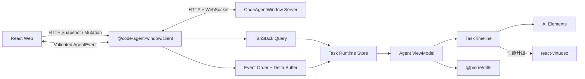
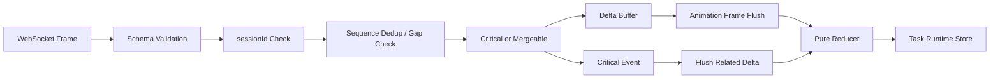

# CodeAgentWindow Web 设计

> 状态：Draft  
> 更新日期：2026-07-22  
> 目标版本：MVP  
> 文档类型：架构说明（Explanation）

## 1. 文档目的

本文定义 CodeAgentWindow Web 的页面结构、组件边界、状态模型、流式事件处理、性能策略和实施顺序，为 `apps/web`、`packages/client` 与 `packages/protocol` 的后续实现提供统一基线。

本文细化 [总体架构设计](./architecture-design.md) 中的 Web 部分，不重复 Codex App Server 子进程、Provider Adapter、SQLite Writer Worker 和 CLI 的内部实现。跨包依赖仍以 [项目结构与工程约束](./project-structure.md) 为准。

目标读者包括：

- Web 功能开发者。
- `packages/client` 和 `packages/protocol` 维护者。
- 负责交互、性能、安全和可访问性评审的开发者。

## 2. 背景

CodeAgentWindow 是通过浏览器操作本地 Coding Agent 的应用。Web 不是普通问答聊天页，而是一个持续运行的工作台，需要同时呈现：

- Project 与 Task 导航。
- 长时间运行的 Turn。
- 流式 Agent Message 和 Reasoning Summary。
- Command、Tool、File Change、Plan、Usage 等结构化 Item。
- Approval 和 User Input 等阻塞请求。
- Diff、错误、重连和 Runtime 状态。

Codex App Server 暴露原生 `Thread -> Turn -> Item` 模型；Client 将 Thread 映射为产品公开的 `Task -> Turn -> Item`，Web 不感知 Provider 原始命名，也不能把所有内容压平成 `user/assistant` 消息数组。

## 3. 目标与非目标

### 3.1 目标

- 提供接近 Codex App 的高密度桌面工作台体验。
- 在高频 Delta、长会话和多 Task 场景下保持输入和滚动流畅。
- 使用 HTTP Snapshot 与可恢复 Agent Event 构建一致状态。
- 通过 Provider 无关的 ViewModel 渲染 Message、Tool、Approval、Plan 和 Diff。
- 使用 AI Elements 缩短 AI 交互组件的开发周期，同时保留源码所有权。
- 默认支持键盘操作、焦点管理、慢连接和错误恢复。
- 保持 Web 只依赖 `@code-agent-window/client` 和 `@code-agent-window/protocol`。

### 3.2 非目标

MVP 不包含：

- SSR、SEO 或 React Server Components。
- 浏览器直连 Codex App Server。
- Vercel AI SDK Runtime 或 AI SDK Stream Protocol。
- 完整 IDE、任意文件编辑器或交互式终端。
- 在输入框中实现通用富文本编辑。
- Voice、Canvas、Workflow Designer 和 Web Preview。
- 为尚未出现的长列表问题提前实现复杂虚拟化。

## 4. 设计原则

### 4.1 协议与展示分离

`packages/protocol` 定义可版本化的网络契约，`packages/client` 负责传输和边界校验，`apps/web` 只消费已验证的统一协议。AI Elements 和页面 ViewModel 不得反向成为 Server 或 Provider 契约。

### 4.2 Snapshot 与实时事件分离

HTTP Snapshot 用于初始化、分页和纠正状态；WebSocket Agent Event 用于低延迟增量更新。二者具有不同生命周期，不能把逐 Token Delta 当作普通 Query 数据持续写入缓存。

### 4.3 高频与关键事件分离

允许合并：

```text
message.delta
reasoning.delta
command.output_delta
```

禁止丢弃或覆盖：

```text
approval.requested
approval.resolved
item.completed
turn.completed
provider.error
```

### 4.4 渐进式性能设计

MVP 使用 AI Elements `Conversation` 完成滚动和底部跟随。当真实数据证明 DOM 规模成为瓶颈时，仅替换 Timeline 内部为 `react-virtuoso`，不提前承担虚拟化复杂度。

### 4.5 源码级 UI 复用

AI Elements 是基于 shadcn/ui 的源码组件注册表。选中的组件复制到仓库后属于项目代码，需要适配本项目类型、样式、性能和安全规则，不把上游示例当作应用架构。

## 5. 总体架构



浏览器端的数据路径为：

```text
HTTP Snapshot
  -> TanStack Query
  -> hydrate Task Runtime Store
  -> Agent ViewModel
  -> React Component

WebSocket AgentEvent
  -> packages/client Schema Validation
  -> sequence 去重与缺口检测
  -> Delta Buffer
  -> Task Runtime Store
  -> Item 级 Selector
  -> React Component
```

## 6. 技术选型

| 领域         | 选择                          | MVP 策略                                 |
| ------------ | ----------------------------- | ---------------------------------------- |
| Web Runtime  | React 19.2 + Vite 8           | 保留现有架构，不引入 Next.js             |
| 路由         | `@tanstack/react-router`      | 管理 Project、Task、Settings 深链接      |
| HTTP 状态    | `@tanstack/react-query`       | 管理 Snapshot、分页、Mutation 和缓存失效 |
| 实时状态     | `zustand/vanilla`             | 创建 Task 级归一化 Store                 |
| Schema       | TypeBox / JSON Schema         | 复用 `@code-agent-window/protocol` 契约  |
| UI 基础      | Tailwind CSS 4 + shadcn/ui    | 为 AI Elements 提供主题和 Primitive      |
| AI UI        | AI Elements                   | 选择性复制并适配，不安装全部组件         |
| Markdown     | AI Elements `MessageResponse` | 底层使用 Streamdown，裁剪无用插件        |
| Conversation | AI Elements `Conversation`    | MVP 使用，保留后续虚拟化替换边界         |
| Diff         | `@pierre/diffs/react`         | 仅在打开 Diff 时动态加载                 |
| 图标         | `lucide-react`                | 用于按钮和状态标识                       |
| 单元测试     | Vitest + Testing Library      | 覆盖状态、组件和交互                     |
| E2E          | Playwright                    | 覆盖真实浏览器关键流程                   |

以下依赖不进入 MVP：

```text
@ai-sdk/react
Vercel AI SDK Runtime
Lexical
Monaco Editor
xterm.js
react-virtuoso
Mermaid
KaTeX
```

`react-virtuoso` 是明确的性能升级候选，不是永久排除项。

## 7. AI Elements 使用策略

### 7.1 采用范围

首批选择性引入：

| AI Elements 组件 | 用途                                | 项目适配                      |
| ---------------- | ----------------------------------- | ----------------------------- |
| `conversation`   | 会话滚动、底部跟随、回到底部按钮    | 包装进 `TaskTimeline`         |
| `message`        | 用户与 Agent 消息、操作栏、Markdown | 替换 `UIMessage` 类型         |
| `reasoning`      | Reasoning Summary 折叠展示          | 映射 Reasoning Item 状态      |
| `tool`           | Tool 调用输入、状态和输出           | 映射统一 Tool ViewModel       |
| `confirmation`   | Command 和 File Change 审批         | 接入 Pending Request Mutation |
| `plan`           | Plan 步骤和状态                     | 映射 Plan Item                |
| `task`           | 紧凑任务活动展示                    | 用于适合的结构化 Item         |
| `prompt-input`   | 文本、附件、工具栏和提交            | 接入 Turn Start / Steer       |
| `attachments`    | 附件 Chip、预览和删除               | 使用 Server 返回的受控引用    |
| `terminal`       | ANSI Command Output                 | 增加输出上限和截断状态        |
| `code-block`     | 稳定代码块                          | 按需高亮                      |
| `model-selector` | Model 选择                          | 数据来自 `/v1/models`         |

### 7.2 不直接采用的组件

- `Commit` 只适合展示提交摘要和文件统计，不能替代完整 Diff Viewer。
- Voice、Canvas、Workflow 和 Web Preview 不属于 MVP。
- `Conversation` 不承担无限历史加载；服务端分页和客户端窗口控制仍然有效。
- 上游 Chatbot 示例不直接复制，因为它依赖 AI SDK `useChat` 和 `UIMessage`。

### 7.3 源码所有权

AI Elements 组件通过 Registry 复制到：

```text
apps/web/src/shared/ai-elements/
```

复制后执行以下调整：

1. 将上游 `@repo/*` 或默认别名改为本项目 `@/*`。
2. 将 `UIMessage`、`ToolUIPart`、`ChatStatus` 替换为项目 ViewModel。
3. 删除 `@ai-sdk/react`、`DefaultChatTransport` 和 AI SDK Stream Protocol 依赖。
4. 删除未使用的 Math、Mermaid、Voice 和 Workflow 相关导入。
5. 保留上游来源、版本或 Commit 信息，后续升级通过 Diff 人工合并。
6. 按项目可访问性、中文文案和紧凑工作台视觉规范调整。

禁止使用上游 CLI 的覆盖模式无审查更新已有组件。

## 8. 页面与导航结构

### 8.1 路由

建议路由：

```text
/
/login
/p/:projectId
/p/:projectId/t/:taskId
/settings
```

路由职责：

| 路由                      | 页面职责                                       |
| ------------------------- | ---------------------------------------------- |
| `/`                       | 检查 Runtime、认证和最近 Project，并进入工作台 |
| `/login`                  | 展示 ChatGPT 登录、Device Code 或错误恢复      |
| `/p/:projectId`           | 唯一工作台的 Project 空任务状态                |
| `/p/:projectId/t/:taskId` | 唯一工作台，显示选中 Task 和 Composer          |
| `/settings`               | 模型、Reasoning、Sandbox、Approval 和外观设置  |

Project 和 Task ID 必须来自 Server，URL 只表示导航意图，不能代替权限校验。

Project 不使用独立页面。用户在工作台左栏通过目录选择器添加本地文件夹，文件夹名作为 Project 名称；真实路径只提交给本地 Runtime 校验，不进入浏览器持久化状态。

### 8.2 应用外壳

桌面端采用三区域工作台：

```text
+----------------+--------------------------------+------------------+
| Project Nav    | Task Timeline                  | Inspector        |
| + Task Tree    |                                | Diff / Details   |
|                |                                |                  |
|                |                                |                  |
|                | Composer                       |                  |
+----------------+--------------------------------+------------------+
```

- Sidebar 默认宽度为 `264px`，支持折叠。
- Timeline 占据剩余空间，宽度使用合理上限保证 Markdown 可读性。
- Inspector 在宽屏工作台默认显示，窄窗口关闭并按需作为抽屉打开。
- Composer 固定在 Timeline 底部，但不能覆盖滚动内容。
- 窗口较窄时 Inspector 变为抽屉，Sidebar 变为可关闭侧栏。

页面不使用营销式 Hero、大量装饰卡片或卡片嵌套。视觉重点是可扫描信息、稳定布局和重复操作效率。

## 9. Web 目录结构

建议目录：

```text
apps/web/src/
  main.tsx
  App.tsx
  app/
    providers.tsx
    router.tsx
    routes/
  features/
    auth/
    projects/
    tasks/
    conversation/
      components/
      runtime/
      view-model/
    composer/
    approvals/
    diff/
    settings/
  shared/
    ai-elements/
    ui/
    hooks/
    styles/
```

边界规则：

- `main.tsx` 只创建 React Root 并装配应用级 Provider。
- `App.tsx` 只提供 App Shell 或 Router Outlet。
- 功能私有组件、Hook、Store 和 ViewModel 保留在对应 `features/*`。
- `shared/ai-elements` 只存放从 AI Elements 复制并经过项目适配的组件。
- `shared/ui` 只存放跨功能稳定复用的基础组件。
- 所有 HTTP 和 WebSocket 访问必须经过 `@code-agent-window/client`。
- Web 禁止导入 `core`、`provider-codex` 或 `server`。

## 10. Client 与 Web 职责

### 10.1 `packages/client`

负责：

- 构造 HTTP 请求和 Idempotency Key。
- 建立、关闭和重连 WebSocket。
- 在边界将 `unknown` 数据通过 Protocol Schema 校验。
- 暴露 Snapshot、Mutation 和 Agent Event 的类型安全 API。
- 处理连接级取消、超时和错误翻译。
- 识别重复 `sequence`、会话变化和恢复要求。

不负责：

- React 状态。
- AI Elements ViewModel。
- 页面导航和弹窗。
- Provider 专有 RPC。

### 10.2 `apps/web`

负责：

- Query、Store 和路由装配。
- Snapshot Hydration 和 Agent Event Reducer。
- Task、Turn、Item ViewModel。
- 页面、组件、交互和可访问性。
- 流式渲染、滚动和性能策略。

## 11. ViewModel 设计

ViewModel 只存在于 Web，组合 Protocol 实体并提供渲染所需字段。它不得成为 HTTP 响应或持久化格式。

建议的 Item ViewModel 判别联合：

```ts
export type AgentItemViewModel =
  | AgentMessageViewModel
  | ReasoningViewModel
  | CommandViewModel
  | ToolViewModel
  | FileChangeViewModel
  | PlanViewModel
  | ApprovalViewModel
  | ErrorViewModel;
```

公共字段：

```ts
export type AgentItemBaseViewModel = {
  id: string;
  taskId: string;
  turnId: string;
  type: string;
  status: "pending" | "running" | "completed" | "failed" | "interrupted";
  startedAt?: string;
  completedAt?: string;
};
```

原则：

- 组件按判别字段进行穷尽分支。
- Provider 差异通过 Capability 和 `extensions` 适配，不按 Provider 名称分支。
- 状态标签在 ViewModel 层统一，避免 AI Elements 自带的 AI SDK 状态泄漏到业务组件。
- Server 返回的 Markdown、命令输出和路径仍视为不可信内容。

## 12. 状态管理

### 12.1 状态分类

| 状态                   | 所有者                | 示例                                   |
| ---------------------- | --------------------- | -------------------------------------- |
| HTTP Server State      | TanStack Query        | Projects、Models、Task Page、Snapshot  |
| Realtime Runtime State | Zustand Vanilla Store | 活动 Turn、Item Delta、Approval、Usage |
| Route State            | TanStack Router       | 当前 Project、Task、Settings 页面      |
| Local UI State         | 最近组件              | 展开状态、Popover、临时选择、Hover     |
| Draft State            | Composer Feature      | Task 草稿、附件和输入模式              |

### 12.2 Query Key

建议统一定义 Query Key Factory：

```text
capabilities
auth.session
models
projects
tasks.list(projectId, filters, cursor)
tasks.detail(taskId)
tasks.snapshot(taskId)
```

Query 规则：

- Task 列表使用 Cursor Pagination。
- Snapshot 获取成功后 Hydrate 对应 Task Runtime Store。
- Mutation 成功后只失效受影响的低频 Query。
- 不为每个 Delta 调用 `queryClient.setQueryData`。
- Task 切换时可以预取目标 Snapshot，但不能产生请求瀑布。

### 12.3 Task Runtime Store

使用 `zustand/vanilla` 的 `createStore` 创建独立 Task Store，通过 Context 注入 Store 引用。建议状态形状：

```ts
export type TaskRuntimeState = {
  taskId: string;
  snapshotSequence: number;
  lastAppliedSequence: number;
  turnIds: string[];
  turnsById: Record<string, TurnState>;
  itemIdsByTurnId: Record<string, string[]>;
  itemsById: Record<string, AgentItemState>;
  pendingRequestIds: string[];
  pendingRequestsById: Record<string, PendingRequestState>;
  connectionState: ConnectionState;
};
```

Store 规则：

- 以 ID 归一化实体。
- 只替换发生变化的实体引用。
- Item 组件通过 `itemId` 原子订阅。
- 不使用返回不稳定对象的大范围 Selector。
- 不通过 React Context 直接广播完整运行时状态。
- 未选中且无活动 Turn 的 Task Store 可以按 LRU 回收。
- Store 不负责持久化，刷新后以 Server Snapshot 为准。

## 13. Agent Event 处理

### 13.1 处理流水线



### 13.2 顺序规则

- `sequence <= lastAppliedSequence` 的事件视为重复并忽略。
- `sequence === lastAppliedSequence + 1` 时正常应用。
- `sequence > lastAppliedSequence + 1` 时发现缺口，暂停增量应用并进入恢复流程。
- `sessionId` 改变表示 Runtime Session 已变化，旧 Sequence 不再可比较。
- 同一个 Item 的 Delta 必须按 Sequence 顺序合并。
- `item.completed` 和 `turn.completed` 是对应实体的最终权威状态。

### 13.3 Delta 合并

Web 层可以把同一动画帧内、同一 Item、同一类型的 Delta 合并后提交 Store。上游 Server 已执行短窗口合并时，Web 不再增加额外固定等待，避免累计延迟超过性能目标。

Terminal Event 到达时必须：

1. 立即冲刷该实体尚未提交的 Delta。
2. 应用 Terminal Event 的完整终态。
3. 清理对应 Buffer。
4. 通知相关低频 Query 更新或失效。

### 13.4 有界队列

浏览器 WebSocket API 不提供接收侧反压。Web 必须限制尚未处理的事件数量和字节数。达到软限制时优先合并 Delta；达到硬限制时主动关闭连接并通过 Snapshot 恢复，不能无限占用内存。

Approval、Error 和 Terminal Event 不能因队列压力丢失。

## 14. 断线恢复

### 14.1 正常恢复

```text
1. 标记 connectionState = reconnecting。
2. 保留当前可见状态，但显示非阻塞连接提示。
3. 请求当前 Task Snapshot。
4. 原子替换 Task Runtime Store。
5. 使用 Snapshot Checkpoint 建立 afterSequence 事件连接。
6. 应用服务端补发事件。
7. 标记 connectionState = connected。
```

### 14.2 事件过期

当服务端无法补发旧 Sequence 时：

- 丢弃未确认 Delta Buffer。
- 重新获取完整 Snapshot。
- 原子替换运行时状态。
- 不在客户端猜测缺失的 Approval 或 Terminal State。

### 14.3 Runtime 重启

收到新的 `sessionId` 时：

- 清空旧 Session Checkpoint。
- 将活动 Turn 临时标记为 `unknown` 或协议定义的等价状态。
- 获取 Snapshot 校正 Task、Turn、Item 和 Pending Request。
- 不因浏览器断线自动中止 Provider Turn。

## 15. Task Timeline

### 15.1 组件边界

业务页面只依赖：

```tsx
<TaskTimeline taskId={taskId} />
```

MVP 内部使用：

```text
TaskTimeline
  -> AI Elements Conversation
    -> ConversationContent
      -> AgentItemRenderer(itemId)
    -> ConversationScrollButton
```

`AgentItemRenderer` 根据 ViewModel 类型选择展示组件：

| ViewModel     | 展示组件                                   |
| ------------- | ------------------------------------------ |
| User Message  | AI Elements `Message`                      |
| Agent Message | `Message` + `MessageResponse`              |
| Reasoning     | AI Elements `Reasoning`                    |
| Command       | AI Elements `Terminal` 或紧凑 Command Item |
| Tool          | AI Elements `Tool`                         |
| File Change   | 项目 File Change Item + Diff Action        |
| Plan          | AI Elements `Plan`                         |
| Approval      | AI Elements `Confirmation`                 |
| Error         | 项目 Error Item                            |

### 15.2 滚动行为

- 首次打开 Task 时定位到最新内容。
- 用户位于底部时，新 Item 和流式内容自动跟随。
- 用户离开底部后，不再抢占滚动位置。
- 新内容到达时显示“回到底部”按钮或未读提示。
- 加载更早历史时保持当前视觉锚点。
- 打开 Diff Inspector 不改变 Timeline 的滚动位置。
- 切换 Task 时恢复各自最近滚动位置，恢复失败则定位到底部。

### 15.3 虚拟化升级条件

AI Elements `Conversation` 会保留已渲染 Item 的 DOM。只有真实性能数据满足以下任一条件时，才将 `TaskTimeline` 内部替换为 `react-virtuoso`：

- 常见 Task 达到约 `300-500` 个已加载 Item。
- Timeline DOM 节点持续超过约 `2,000-3,000`。
- 打开长 Task 的前端渲染耗时超过 `200ms`。
- 流式输出或滚动期间频繁出现超过 `50ms` 的 Long Task。
- 滚动帧预算持续超过 `16ms`，产生用户可见卡顿。
- Task 切换后内存无法回落到稳定范围。

这些数值是启动性能评审的工程阈值，不是产品硬限制。升级后仍复用 `AgentItemRenderer`、ViewModel 和 Store，不改变页面与协议。

## 16. Markdown 与代码

### 16.1 MessageResponse

AI Elements `MessageResponse` 底层使用 Streamdown，适合处理流式阶段未闭合的 Markdown。项目保留以下能力：

- GitHub Flavored Markdown。
- 未闭合 Markdown 的渐进渲染。
- 代码块复制。
- 安全链接处理。
- CJK 文本支持。
- 稳定代码块的语法高亮。

MVP 移除：

```text
@streamdown/math
@streamdown/mermaid
```

### 16.2 渲染策略

- 只有当前流式 Message 持续更新 Markdown。
- 已完成 Message 使用稳定 Props 和 `React.memo`。
- 未完成代码围栏优先显示纯代码，不重复执行高成本高亮。
- 代码块完成后再启用 Shiki 高亮。
- 高亮器和 Diff Viewer 通过动态导入进入独立 Chunk。
- 不使用 `dangerouslySetInnerHTML` 渲染模型输出。

### 16.3 链接安全

- 默认只允许 `http` 和 `https` 外部链接。
- 外部链接使用明确的安全属性，并由用户主动打开。
- `file://`、`javascript:` 和未知协议必须拒绝。
- Project 文件引用转换为项目内部动作，交给 Server 重新执行权限和路径校验。

## 17. Command、Terminal 与 Diff

### 17.1 Command Output

AI Elements `Terminal` 用于显示 ANSI Output，但它不是交互式终端。MVP 规则：

- 只读显示 stdout、stderr、状态和退出码。
- 保留 ANSI 颜色，但禁止把输出当作 HTML。
- 流式时仅更新当前 Command Item。
- 默认折叠已完成的大型输出。
- Live View 最多保留 `10,000` 行或 `1 MiB` 文本，先达到者触发截断提示。
- 完整输出如需查看，由 Server 提供受控分页或下载能力，不在浏览器永久保存无限文本。

### 17.2 Diff

完整 Diff 使用 `@pierre/diffs/react`，按需加载。AI Elements `Commit` 只用于提交或文件变化摘要。

Diff 规则：

- 只消费 Server 提供的完整 Diff Snapshot。
- 不在 Web 中拼接历史 Patch。
- 支持 Unified 和 Split 模式。
- 默认使用只读渲染。
- 大 Diff 使用库提供的 Virtualizer 或按文件分段加载。
- Diff Theme 与应用主题保持一致。
- Inspector 关闭后释放大型 Diff 渲染树。

## 18. Composer

### 18.1 MVP 方案

MVP 使用 AI Elements `PromptInput`，不引入 Lexical。它负责：

- 自动高度 Textarea。
- Enter 提交、Shift+Enter 换行。
- IME Composition 期间阻止误提交。
- 文件选择、拖放和粘贴。
- 附件预览与删除。
- Model、Reasoning 和工具按钮布局。
- Submit、Stop 和运行状态图标。

### 18.2 输入模型

PromptInput 提交时转换为 Protocol 定义的结构化输入，而不是发送 AI SDK `UIMessage`：

```text
PromptInputMessage
  -> Composer Adapter
  -> AgentInput[]
  -> @code-agent-window/client
  -> POST /v1/tasks/:taskId/turns
```

附件必须先转换为 Server 认可的受控引用。浏览器不得提交任意本地绝对路径作为已授权文件。

### 18.3 Turn Start、Steer 与 Interrupt

Composer 根据 Task 状态提供不同动作：

| 状态                   | 主动作                 | 次动作                       |
| ---------------------- | ---------------------- | ---------------------------- |
| Idle                   | Start Turn             | 无                           |
| Running 且支持 Steer   | Steer                  | Interrupt                    |
| Running 且不支持 Steer | Queue 或禁用提交       | Interrupt                    |
| Awaiting Approval      | 保持可输入             | Resolve Approval / Interrupt |
| Reconnecting           | 保留草稿，禁用网络提交 | Retry                        |

写操作使用 Idempotency Key。网络错误时保留原始草稿和附件状态，成功响应后再清空。

### 18.4 草稿

- 草稿按 `projectId + taskId` 隔离。
- 小型纯文本草稿可以存入 `localStorage`。
- 附件只保存可恢复的元数据，不持久化短生命周期 Blob URL。
- Task 删除、归档或 Project 移除时清理对应草稿。

### 18.5 Lexical 升级条件

只有明确需要以下能力时才引入 Lexical：

- 输入区域内的不可拆分文件 Mention 节点。
- 结构化 Slash Command 节点。
- 多种内联实体和复杂光标行为。
- 富文本复制、粘贴和序列化。

## 19. Approval 与 User Input

### 19.1 Approval

Approval 使用 AI Elements `Confirmation` 作为展示基础，但业务状态来自统一 Pending Request。

必须展示：

- 操作类型。
- 目标文件或命令摘要。
- 风险相关参数。
- Allow、Deny 和可用的 Remember 选项。
- 请求状态和过期状态。

提交 Approval 时必须携带 Request ID，并由 Server 再次校验 Runtime、Task、Turn、Item、用户和状态。按钮点击后立即进入提交态，防止重复操作。

### 19.2 User Input

User Input Request 可能包含选择题、确认或短文本。使用语义化 Radio、Checkbox、Input 和 Button，不把所有问题渲染成自由文本框。

多个 Pending Request 按到达顺序展示，当前请求处理完成后再进入下一项。Turn 完成、中断或 Request 过期时关闭对应交互并保留最终状态说明。

## 20. 页面状态

每个主要页面必须定义以下状态：

| 状态                   | 表现                                           |
| ---------------------- | ---------------------------------------------- |
| Initial Loading        | 保持布局稳定的 Skeleton，不显示空白页面        |
| Empty                  | 提供符合当前上下文的主要动作                   |
| Slow                   | 显示非阻塞进度和连接说明，不清空已有内容       |
| Error                  | 展示可操作错误、Retry 和诊断 ID                |
| Reconnecting           | 保留当前 Task，显示连接状态并暂停危险 Mutation |
| Offline                | 保留草稿和已加载内容，明确不可提交             |
| Unauthorized           | 进入登录或重新授权流程                         |
| Unsupported Capability | 隐藏或禁用对应功能，不按 Provider 名称分支     |

Error Boundary 至少分为：

- 应用级 Boundary。
- 路由级 Boundary。
- Item Renderer Boundary。
- Diff 和大型按需组件 Boundary。

单个未知或损坏 Item 不得导致整个 Task 无法使用。

## 21. 可访问性与键盘交互

- 所有图标按钮提供可访问名称和 Tooltip。
- Button、Dialog、Menu、Tabs、Radio 和 Checkbox 使用语义化 Primitive。
- Approval 打开时移动焦点，但不无条件使用阻塞 Modal 打断正在查看的内容。
- Dialog 关闭后焦点返回触发控件。
- 新增流式文本不通过 `aria-live` 逐 Token 宣读。
- Turn 完成、Approval 到达和 Error 使用节流后的状态通知。
- Composer 支持标准文本编辑、IME 和屏幕阅读器。
- Sidebar、Timeline、Inspector 和 Composer 具有明确的 Landmark。
- 不只依赖颜色表达 Running、Failed、Approved 和 Denied。

建议的键盘行为：

| 操作               | 默认行为                                 |
| ------------------ | ---------------------------------------- |
| 提交               | Enter                                    |
| 换行               | Shift+Enter                              |
| 中断               | 使用可发现按钮，快捷键后续按用户研究决定 |
| 关闭 Dialog / Menu | Escape                                   |
| Task 导航          | 标准列表键盘行为                         |
| Command Palette    | 后续引入时使用平台标准组合键             |

## 22. 安全边界

### 22.1 浏览器信任模型

浏览器中的用户输入、URL 参数、模型输出、Markdown、命令输出、文件路径和 AI Elements 组件状态都不是安全边界。

Server 必须执行最终权限判断。Web 只负责减少误操作和展示已验证状态。

### 22.2 内容安全

- Markdown 禁止原始 HTML 和危险协议。
- Command Output 以文本和安全 ANSI Token 渲染。
- Diff、路径和错误文本不插入 HTML。
- 外部图片默认不自动访问未知来源；需要明确的图片代理或策略。
- 不把 Token、API Key、完整 Prompt、完整命令输出写入浏览器日志。

### 22.3 网络与操作

- WebSocket 由 Server 校验 Origin 和 Session。
- 所有 Mutation 使用统一 Client，并处理 CSRF、认证和 Idempotency。
- Project 文件操作每次由 Server 校验绝对路径、`realpath` 和允许根目录。
- Approval 必须由 Server 校验当前 Pending Request，Web 禁止构造任意 Provider 响应。
- 不向页面暴露任意 JSON-RPC、`command/exec`、`process/spawn` 或文件系统透传接口。

## 23. 性能设计

### 23.1 性能预算

| 指标                   | 目标                               |
| ---------------------- | ---------------------------------- |
| Agent Event 到可见更新 | `p95 < 100ms`                      |
| Task 元数据列表打开    | `p95 < 300ms`                      |
| WebSocket 恢复         | `p95 < 1s`，不含 Provider 恢复     |
| Composer 输入          | 常规输入无可感知延迟               |
| 流式渲染               | 不持续产生超过 `50ms` 的 Long Task |
| 布局                   | 流式更新不引起无关区域明显位移     |
| DOM                    | 未虚拟化阶段受分页和已加载窗口约束 |

### 23.2 渲染规则

- Store 更新按 Item 精确通知。
- 当前流式 Item 与已完成 Item 使用不同渲染路径。
- 不在父级 Task 组件读取完整 `itemsById` 对象。
- 不在 Render 中解析协议、聚合大型数组或转换完整历史。
- Stable Callback 和 Selector 只在有实际重渲染价值时引入。
- Diff、高亮器和非首屏 Inspector 动态加载。
- 使用 React Profiler 和浏览器 Performance 数据决定优化，不以组件数量猜测瓶颈。

### 23.3 内存规则

- 未选中且无活动 Turn 的 Task Runtime Store 允许回收。
- Command Output、Event Buffer 和诊断数据必须有界。
- Blob URL 在附件删除、提交成功或组件卸载时释放。
- Query Cache 为 Task Page 和 Snapshot 设置合理 GC 时间。
- 浏览器不保存完整 Provider 原始事件日志。

## 24. 测试策略

### 24.1 单元测试

重点覆盖：

- Snapshot Hydration。
- Agent Event Reducer。
- Sequence 去重和缺口识别。
- Delta 合并与 Terminal Event 冲刷。
- Runtime Session 变化。
- Approval 状态机。
- ViewModel 映射和未知 Item 降级。
- Composer Start、Steer、Interrupt 和失败保留草稿。

事件 Reducer 测试优先使用录制后的、已脱敏的 Agent Event Fixture，并保证相同输入产生相同状态。

### 24.2 组件测试

使用 Vitest 和 Testing Library 验证：

- Message、Reasoning、Tool、Plan 和 Error 的用户可见状态。
- Approval 的允许、拒绝、重复提交和过期。
- PromptInput 的 IME、附件粘贴、Enter 和 Shift+Enter。
- 用户离开底部后流式内容不抢滚动。
- 单个 Item Renderer 失败不会破坏 Timeline。
- 键盘、焦点和可访问名称。

### 24.3 Client 集成测试

使用 Fake Agent Server 或等价测试适配器覆盖：

- 正常 Snapshot + Event 流。
- 重复 Event。
- Sequence Gap。
- Event Retention 过期。
- Runtime Session 重启。
- Approval 期间断线。
- 超大 Command Output。
- Schema 不匹配和未知 Event。

### 24.4 E2E

Playwright 覆盖：

```text
登录状态与恢复
Project 选择
创建和切换 Task
流式 Agent Message
Command 和 Tool 状态
Diff Inspector
Approval Allow / Deny
User Input Request
Turn Steer / Interrupt
刷新页面恢复
断线重连
长历史滚动
窄窗口布局
```

### 24.5 性能验证

- 回放高频小 Delta。
- 回放大型 Command Output。
- 测量当前 Item 和已完成 Item 的重渲染次数。
- 测量 `delta received -> paint` 延迟。
- 测量长 Task 首次打开和切换耗时。
- 记录 DOM 节点、Long Task 和 Heap 变化。
- 达到虚拟化评审阈值时建立 Conversation 与 Virtuoso 对照基准。

## 25. 分阶段实施

### 阶段一：Web Foundation

- 配置 Tailwind CSS、shadcn/ui 和设计 Token。
- 建立 TanStack Router 和应用级 Provider。
- 实现 Client HTTP 基础调用。
- 完成登录、App Shell 和 Project Navigator。

完成标准：根路径直接进入唯一工作台，左栏可以选择 Project 并显示其 Task 列表和明确状态。

### 阶段二：Conversation Read Path

- 选择性引入 AI Elements Conversation、Message 和 Reasoning。
- 实现 Task Snapshot Query。
- 实现 Task Runtime Store 和 Snapshot Hydration。
- 实现 AgentItemRenderer 和基础 ViewModel。
- 实现分页历史与滚动恢复。

完成标准：可以稳定读取 Task，并正确显示结构化历史。

### 阶段三：Realtime Path

- 实现 WebSocket 生命周期、Sequence 和 Session 处理。
- 实现 Delta Buffer、Reducer 和关键事件冲刷。
- 实现重连、事件过期和 Snapshot 恢复。
- 增加连接状态和错误提示。

完成标准：流式输出、断线恢复和刷新校正通过测试。

### 阶段四：Agent Actions

- 引入 PromptInput、Attachments 和 Model Selector。
- 实现 Turn Start、Steer 和 Interrupt。
- 引入 Tool、Confirmation、Plan、Task 和 Terminal。
- 实现 Approval、User Input 和草稿保留。

完成标准：核心 Coding Agent 工作流可从 Web 完成。

### 阶段五：Diff、质量与性能

- 接入 `@pierre/diffs/react` 和 Inspector。
- 完成可访问性和键盘检查。
- 完成关键 Playwright E2E。
- 回放长历史和高频 Delta。
- 根据真实指标决定是否引入 `react-virtuoso`。

完成标准：达到性能预算，并通过 Web MVP 验收流程。

## 26. 依赖引入顺序

依赖只在对应功能实际实现时加入 `apps/web/package.json` 和根 Catalog。

第一批：

```text
@tanstack/react-router
@tanstack/react-query
zustand
tailwindcss
lucide-react
AI Elements 选中组件需要的 shadcn/ui 依赖
```

第二批：

```text
streamdown
@streamdown/code
@streamdown/cjk
use-stick-to-bottom
ansi-to-react
```

第三批：

```text
@pierre/diffs
```

按性能数据决定：

```text
react-virtuoso
```

禁止只为使用 AI Elements 示例而引入：

```text
ai
@ai-sdk/react
```

如果某个复制组件仅为 TypeScript 类型导入 `ai`，应将其类型替换为项目 ViewModel，而不是增加 AI SDK 依赖。

## 27. 关键架构决策

### 27.1 使用 AI Elements 作为展示层，不作为 Runtime

决定：采用。

原因：它覆盖 Message、Reasoning、Tool、Approval、Plan、PromptInput、Terminal 等高成本 UI，但不提供项目需要的 Snapshot、Sequence、恢复和 Provider 抽象。

### 27.2 MVP 使用 Conversation，不提前使用 Virtuoso

决定：采用 AI Elements `Conversation`。

原因：真实长历史规模尚未建立，先用简单完整的滚动体验。通过 `TaskTimeline` 隔离实现，达到明确性能阈值后再替换。

### 27.3 MVP 不使用 Lexical

决定：使用 AI Elements `PromptInput` 的 Textarea。

原因：MVP 所需的 IME、附件、快捷键和工具栏已经覆盖。只有出现内联结构化节点需求时才升级编辑器。

### 27.4 不采用 AI SDK Runtime

决定：不采用 `useChat`、`UIMessage` 和 AI SDK Stream Protocol。

原因：本项目的数据模型是 Task、Turn、Item、Approval 和可恢复 Agent Event。引入 AI SDK Runtime 会形成重复状态和有损转换。

### 27.5 完整 Diff 使用专用组件

决定：使用 `@pierre/diffs/react`。

原因：AI Elements `Commit` 只展示摘要，不覆盖逐行 Diff、Split View 和大型 Diff 虚拟化。

## 28. 实施检查清单

每个 Web 功能提交前确认：

- 功能位于正确的 `features/*` 或稳定的 `shared/*` 边界。
- HTTP 和 WebSocket 只通过 `@code-agent-window/client`。
- 不在 Web 重复声明 Protocol 类型。
- `unknown` 数据已在 Client 边界校验。
- 流式 Item 独立订阅，没有导致整个 Task 重渲染。
- Approval、Error 和 Terminal State 不会因合并而丢失。
- 加载、空、慢、错误、断线和终态都有明确 UI。
- 键盘、焦点和可访问名称已验证。
- Markdown、路径、命令输出和链接按不可信内容处理。
- 动态依赖不会无条件进入首屏 Bundle。
- 组件测试断言用户可观察行为。
- 页面行为变更运行 `pnpm test:e2e`。
- 完成后运行 `pnpm check`。

## 29. 参考资料

### 项目文档

- [CodeAgentWindow 架构设计](./architecture-design.md)
- [项目结构与工程约束](./project-structure.md)
- [Web 前端开发规范](../.superwork/spec/frontend/index.md)
- [前端状态管理](../.superwork/spec/frontend/state-management.md)
- [React 组件规范](../.superwork/spec/frontend/component-guidelines.md)
- [Web 类型安全](../.superwork/spec/frontend/type-safety.md)

### 官方与社区项目

- [Codex App Server](https://learn.chatgpt.com/docs/app-server)
- [Codex App Server Source](https://github.com/openai/codex/tree/main/codex-rs/app-server)
- [Vercel AI Elements](https://github.com/vercel/ai-elements)
- [AI Elements Components](https://elements.ai-sdk.dev)
- [Streamdown](https://github.com/vercel/streamdown)
- [TanStack Query Render Optimizations](https://tanstack.com/query/latest/docs/framework/react/guides/render-optimizations)
- [Zustand Selectors](https://zustand.docs.pmnd.rs/learn/guides/prevent-rerenders-with-use-shallow)
- [React Virtuoso](https://virtuoso.dev/react-virtuoso/api-reference/virtuoso/)
- [Pierre Diffs](https://diffs.com/docs)

社区组件只作为 UI 与工程模式参考。协议、权限和恢复行为以 CodeAgentWindow Protocol、Codex 官方文档和目标 Codex CLI 版本的契约测试为准。
