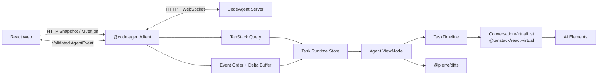
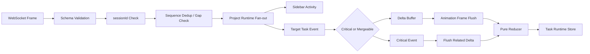

# CodeAgent Web 设计

> 状态：Draft  
> 更新日期：2026-07-29
> 目标版本：MVP  
> 文档类型：架构说明（Explanation）

## 1. 文档目的

本文定义 CodeAgent Web 的页面结构、组件边界、状态模型、流式事件处理、性能策略和实施顺序，为 `apps/web`、`packages/client` 与 `packages/protocol` 的后续实现提供统一基线。

本文细化 [总体架构设计](./architecture-design.md) 中的 Web 部分，不重复 Codex App Server 子进程、Provider Adapter、SQLite Database Worker 和 CLI 的内部实现。跨包依赖仍以 [项目结构与工程约束](./project-structure.md) 为准。

目标读者包括：

- Web 功能开发者。
- `packages/client` 和 `packages/protocol` 维护者。
- 负责交互、性能、安全和可访问性评审的开发者。

## 2. 背景

CodeAgent 是通过浏览器操作本地 Coding Agent 的应用。Web 不是普通问答聊天页，而是一个持续运行的工作台，需要同时呈现：

- Project 与 Task 导航。
- 长时间运行的 Turn。
- 流式 Commentary 与 Final Answer 消息。
- Command、Tool、File Change、Plan、Usage 等结构化 Item。
- Approval 和 User Input 等阻塞请求。
- Diff、错误、重连和 Runtime 状态。

Codex App Server 暴露原生 `Thread -> Turn -> Item` 模型；Client 将 Thread 映射为产品公开的 `Task -> Turn -> Item`，Web 不感知 Provider 原始命名，也不能把所有内容压平成 `user/assistant` 消息数组。

## 3. 目标与非目标

### 3.1 目标

- 提供接近 Codex App 的高密度桌面工作台体验。
- 在高频 Delta、长会话和多 Task 场景下保持输入和滚动流畅。
- 使用 HTTP Snapshot 与可恢复 Agent Event 构建一致状态。
- 通过 Provider 无关的 ViewModel 渲染 Message、Tool、Approval、Plan 和 Diff。
- 使用 AI Elements 缩短 AI 交互组件的开发周期，同时保留源码所有权。
- 默认支持键盘操作、焦点管理、慢连接和错误恢复。
- 保持 Web 只依赖 `@code-agent/client` 和 `@code-agent/protocol`。

### 3.2 非目标

MVP 不包含：

- SSR、SEO 或 React Server Components。
- 浏览器直连 Codex App Server。
- Vercel AI SDK Runtime 或 AI SDK Stream Protocol。
- 完整 IDE、任意文件编辑器或交互式终端。
- 在输入框中实现通用富文本编辑。
- Voice、Canvas、Workflow Designer 和 Web Preview。
- 为尚未出现的长列表问题提前实现复杂虚拟化。

## 4. 设计原则

### 4.1 协议与展示分离

`packages/protocol` 定义可版本化的网络契约，`packages/client` 负责传输和边界校验，`apps/web` 只消费已验证的统一协议。AI Elements 和页面 ViewModel 不得反向成为 Server 或 Provider 契约。

### 4.2 Snapshot 与实时事件分离

HTTP Snapshot 用于初始化、分页和纠正状态；WebSocket Agent Event 用于低延迟增量更新。二者具有不同生命周期，不能把逐 Token Delta 当作普通 Query 数据持续写入缓存。

### 4.3 高频与关键事件分离

允许合并：

```text
message.delta
reasoning.delta
command.output_delta
```

禁止丢弃或覆盖：

```text
approval.requested
approval.resolved
item.completed
turn.completed
provider.error
```

### 4.4 渐进式性能设计

Task Timeline 使用本地 AI Elements `Conversation` 保留滚动语义和底部跟随，并用 `@tanstack/react-virtual` 按 Turn 动态测高。虚拟列表只替换 Turn 列表与滚动职责，Message、Tool、Plan、Task、Terminal、Approval 等内容组件保持原有渲染边界。

### 4.5 源码级 UI 复用

AI Elements 是基于 shadcn/ui 的源码组件注册表。选中的组件复制到仓库后属于项目代码，需要适配本项目类型、样式、性能和安全规则，不把上游示例当作应用架构。

## 5. 总体架构


```mermaid
flowchart LR
    Browser["React Web"] -->|"HTTP Snapshot / Mutation"| Client["@code-agent/client"]
    Browser <-->|"Validated AgentEvent"| Client
    Client <-->|"HTTP + WebSocket"| Server["CodeAgent Server"]

    Query["TanStack Query"] --> Runtime["Task Runtime Store"]
    Client --> Query
    Client --> Buffer["Event Order + Delta Buffer"]
    Buffer --> Runtime

    Runtime --> VM["Agent ViewModel"]
    VM --> Timeline["TaskTimeline"]
    Timeline --> VirtualList["ConversationVirtualList<br/>@tanstack/react-virtual"]
    VirtualList --> Elements["AI Elements"]
    VM --> Diff["@pierre/diffs"]
```

浏览器端的数据路径为：

```text
HTTP Snapshot
  -> TanStack Query
  -> hydrate Task Runtime Store
  -> Agent ViewModel
  -> React Component

WebSocket AgentEvent
  -> packages/client Schema Validation
  -> sequence 去重与缺口检测
  -> Delta Buffer
  -> Task Runtime Store
  -> Item 级 Selector
  -> React Component
```

## 6. 技术选型

| 领域         | 选择                                                   | MVP 策略                                 |
| ------------ | ------------------------------------------------------ | ---------------------------------------- |
| Web Runtime  | React 19.2 + Vite 8                                    | 保留现有架构，不引入 Next.js             |
| 路由         | `@tanstack/react-router`                               | 管理 Project、Task、Settings 深链接      |
| HTTP 状态    | `@tanstack/react-query`                                | 管理 Snapshot、分页、Mutation 和缓存失效 |
| 实时状态     | `zustand/vanilla`                                      | 创建 Task 级归一化 Store                 |
| Schema       | TypeBox / JSON Schema                                  | 复用 `@code-agent/protocol` 契约         |
| UI 基础      | Tailwind CSS 4 + shadcn/ui                             | 为 AI Elements 提供主题和 Primitive      |
| AI UI        | AI Elements                                            | 选择性复制并适配，不安装全部组件         |
| Markdown     | AI Elements `MessageResponse`                          | 底层使用 Streamdown，裁剪无用插件        |
| Conversation | AI Elements `Conversation` + `@tanstack/react-virtual` | 按 Turn 动态测高并保留底部跟随           |
| Diff         | `@pierre/diffs/react`                                  | 仅在打开 Diff 时动态加载                 |
| 图标         | `lucide-react`                                         | 用于按钮和状态标识                       |
| 单元测试     | Vitest + Testing Library                               | 覆盖状态、组件和交互                     |
| E2E          | Playwright                                             | 覆盖真实浏览器关键流程                   |

### 6.1 浏览器兼容边界

| 浏览器          | 最低版本 | Vite 构建目标 |
| --------------- | -------- | ------------- |
| Chrome/Chromium | 116      | `chrome116`   |
| Firefox         | 124      | `firefox124`  |
| Safari          | 17.4     | `safari17.4`  |

该边界覆盖 Client 直接使用的 `AbortSignal.timeout()`、`AbortSignal.any()`，以及 Web 状态逻辑使用的 `toSorted()`、`toSpliced()`。Vite 只按 `build.target` 转译语法，不为这些运行时 API 注入 polyfill，因此更早浏览器不提供兼容分支。

Playwright E2E 当前只运行 Chromium，用于验证关键用户流程和浏览器装配，不作为 Firefox、Safari 的完整兼容性证明。调整最低版本或引入新的浏览器运行时 API 时，必须同步更新 Vite 目标、README 和前端质量规范。

以下依赖不进入 MVP：

```text
@ai-sdk/react
Vercel AI SDK Runtime
Lexical
Monaco Editor
xterm.js
Mermaid
KaTeX
```

## 7. AI Elements 使用策略

### 7.1 采用范围

首批选择性引入：

| AI Elements 组件 | 用途                                 | 项目适配                        |
| ---------------- | ------------------------------------ | ------------------------------- |
| `conversation`   | 会话滚动、底部跟随、回到底部按钮     | 包装进 `TaskTimeline`           |
| `message`        | 用户消息、Commentary 与 Final Answer | 映射消息状态并流式渲染 Markdown |
| `review`         | 固定审查请求与审查模式标识           | 从结构化 Target 生成本地化文案  |
| `tool`           | Tool 调用输入、状态和输出            | 映射统一 Tool ViewModel         |
| `confirmation`   | Command 和 File Change 审批          | 接入 Pending Request Mutation   |
| `plan`           | Plan 步骤和状态                      | 映射 Plan Item                  |
| `task`           | 紧凑任务活动展示                     | 用于适合的结构化 Item           |
| `prompt-input`   | 文本、附件、工具栏和提交             | 接入 Turn Start / Steer         |
| `attachments`    | 附件 Chip、预览和删除                | 使用 Server 返回的受控引用      |
| `terminal`       | ANSI Command Output                  | 增加输出上限和截断状态          |
| `code-block`     | 稳定代码块                           | 按需高亮                        |
| `file-tree`      | Inspector Project 文件目录           | 组合受限文件树与源码预览        |
| `model-selector` | Model 选择                           | 数据来自 `/v1/models`           |

### 7.2 不直接采用的组件

- `Commit` 只适合展示提交摘要和文件统计，不能替代完整 Diff Viewer。
- Voice、Canvas、Workflow 和 Web Preview 不属于 MVP。
- `Conversation` 不承担无限历史加载；服务端分页和客户端窗口控制仍然有效。
- 上游 Chatbot 示例不直接复制，因为它依赖 AI SDK `useChat` 和 `UIMessage`。

### 7.3 源码所有权

AI Elements 组件通过 Registry 复制到：

```text
apps/web/src/shared/ai-elements/
```

复制后执行以下调整：

1. 将上游 `@repo/*` 或默认别名改为本项目 `@/*`。
2. 将 `UIMessage`、`ToolUIPart`、`ChatStatus` 替换为项目 ViewModel。
3. 删除 `@ai-sdk/react`、`DefaultChatTransport` 和 AI SDK Stream Protocol 依赖。
4. 删除未使用的 Math、Mermaid、Voice 和 Workflow 相关导入。
5. 保留上游来源、版本或 Commit 信息，后续升级通过 Diff 人工合并。
6. 按项目可访问性、中文文案和紧凑工作台视觉规范调整。

禁止使用上游 CLI 的覆盖模式无审查更新已有组件。

## 8. 页面与导航结构

### 8.1 路由

建议路由：

```text
/
/p/:projectId
/p/:projectId/t/:taskId
```

路由职责：

| 路由                      | 页面职责                                  |
| ------------------------- | ----------------------------------------- |
| `/`                       | 检查 Runtime 和最近 Project，并进入工作台 |
| `/p/:projectId`           | 唯一工作台的 Project 空任务状态           |
| `/p/:projectId/t/:taskId` | 唯一工作台，显示选中 Task 和 Composer     |

Project 和 Task ID 必须来自 Server，URL 只表示导航意图，不能代替权限校验。

Project 不使用独立页面。用户在工作台左栏打开 shadcn Dialog，通过 AI Elements `FileTree` 浏览运行 CodeAgent 的设备上的目录；初始位置为 Server 用户主目录，目录展开时按需读取直接子目录，并可向上导航。确认后以所选绝对路径注册 Project，文件夹名作为 Project 名称；Server 规范化并校验真实目录后持久化，Web 只通过 Client API 读取和注册 Project，不直接访问文件系统或数据库。该链路同时服务本地与已配对 LAN 浏览器，不调用 Server 宿主 GUI。

每个 Project 名称行在新建 Task 的 `+` 左侧显示省略号菜单，菜单只提供重命名和删除。重命名仅更新 CodeAgent 持久化的展示名，不修改 `rootPath` 或磁盘文件夹名；删除仅移除 Project 注册、关联的本地设置/元数据以及对应 Web/Server Runtime，不删除磁盘目录、文件或 Codex Task。删除当前 Project 后进入剩余列表首项，删除最后一个 Project 后进入工作台空状态。

左栏 Settings 使用原生 Dialog 在当前工作台内打开，不产生路由跳转。弹窗采用 macOS 设置式双栏结构，将字段归入“外观”“Agent 默认值”“提交消息”“应用集成”；窄屏时分类导航改为顶部横向排列。Agent 与提交配置继续使用 AI Elements Select，其中默认跟进消息可选择“排队”或“引导”；外观提供浅色/深色分段控件，关闭后焦点返回左栏入口。

Project 名称行短按继续展开或收起 Task；指针移动超过点击容差后立即判定为拖拽并调整 Projects 顺序，不设置固定长按等待。释放时通过 Client 提交当前完整 Project ID 顺序，刷新页面和重启 Runtime 后保持；键盘聚焦名称行后可用 `Alt + ArrowUp/ArrowDown` 完成同样操作。

### 8.2 应用外壳

桌面端采用三区域工作台：

```text
+----------------+--------------------------------+------------------+
| Project Nav    | Task Timeline                  | Inspector        |
| + Task Tree    |                                | Diff / Details   |
|                |                                |                  |
|                |                                |                  |
|                | Composer                       |                  |
+----------------+--------------------------------+------------------+
```

- Sidebar 默认宽度为 `264px`，支持折叠。
- Timeline 占据剩余空间，宽度使用合理上限保证 Markdown 可读性。
- Inspector 在宽屏工作台默认显示，窄窗口关闭并按需作为抽屉打开。
- Inspector 的“变更”页签固定保留只读的未提交变更摘要：左侧在标题下方同行展示变更总数和增删统计，最右侧并排展示相同中性背景的“审核”与“提交”按钮。“审核”打开统一文件审核 Dialog，“提交”暂不绑定操作；摘要下方使用 AI Elements `FileTree` 展示受限 Project 文件树，目录默认折叠并在用户展开时按需加载直接子项。存在 Git 变更的文件选择打开 Diff；其余文件复用 AI Markdown 文件引用分流，在项目内预览源码、文档和图片，并将不可预览格式交给系统默认应用。文件或目录节点右键后进入选中高亮态，并显示中栏 Project 打开控件的同一宿主应用列表；菜单顶部标识“打开方式”和当前目标路径，选择后立即用对应应用打开该目标，但不改写中栏默认应用偏好。
- Composer 固定在 Timeline 底部，但不能覆盖滚动内容。
- Composer 左侧依次展示附件、审批和沙盒模式；附件菜单的“添加图片”和“添加文件”打开宿主 FileTree Dialog，从 CodeAgent 运行设备的主目录开始按需浏览，已配对 LAN 浏览器使用相同交互，不调用浏览器原生文件选择器。沙盒模式使用 Codex 有效 Project 配置初始化，并允许选择只读、工作区可写或完全访问。右侧继续展示模型、思考量和提交操作。
- 活动 Turn 运行时，非空 Composer 按全局默认行为将消息加入当前 Task 的 FIFO 队列或立即作为 `turn/steer` 引导发送；空输入仍显示停止操作。队列固定展示在输入框外部上方，每项提供带 Tooltip 的立即引导和取消图标按钮。
- 排队项保存文本、Skill 与本地附件引用，附件只在实际发送时上传；当前 Turn 结束后自动启动队首消息，发送失败时保留队列。队列按 Task 草稿作用域隔离，取消、发送或 Draft Store 释放时同步释放不再使用的附件预览。
- Composer 在文本开头或空白字符后输入 `/` 时显示外部浮层，连续正文字符后的 `/` 不触发；浮层先展示本地 Task 命令，再在命令组下方展示当前 Project 的 Codex Skills。每次选择只移除当前 Slash 片段并保留已有正文，允许在正文任意位置插入多个有序的 `accent` 主色 Token。Token 显示 Skill 展示名，内部值与复制文本为 `$<skill.name>`，可点击或使用邻接删除键移除。提交按 Token 顺序携带统一 Skill ID 与名称，不把 `$name` 拼接进普通正文，也不接收原生路径。
- 用户消息通过统一消息字段按顺序携带已使用的多个 Skill 名称，并在 Timeline 中复用编辑器的 `accent` 主色 Token 模块；该行为同时覆盖提交后的实时 Turn、首轮乐观消息和重新打开 Task 后由 Codex `userMessage.content` 恢复的历史消息。Codex 返回的 Skill 路径在 Provider 映射后丢弃，不进入 Web。
- 窗口较窄时 Inspector 变为抽屉，Sidebar 变为可关闭侧栏。
- Sidebar 的 `Projects` 标题固定在项目树滚动区外，Project 行连续排列并支持持久化重排；每个 Project 使用独立 Cursor Infinite Query，首屏只请求并显示 5 个 Task。“显示更多”每次只加载该 Project 的一个下一页，失败时保留已有列表并可重试，全部加载后允许收起。归档后先移除缓存任务，再重新校准活动 Cursor 页面并自动补足最近 5 项。非空搜索使用独立的按 Project 全量搜索源：Project 之间并行、单个 Project 内追踪全部 Cursor，完整加载后再过滤标题，不能只搜索当前渲染项。新建、固定、重命名和归档同步维护普通 Infinite Query 与已存在的搜索缓存。Task 行 hover/focus 时以省略号替换时间，并通过菜单执行固定、重命名和归档。

页面不使用营销式 Hero、大量装饰卡片或卡片嵌套。视觉重点是可扫描信息、稳定布局和重复操作效率。

## 9. Web 目录结构

建议目录：

```text
apps/web/src/
  main.tsx
  App.tsx
  app/
    providers.tsx
    router.tsx
    routes/
  features/
    auth/
    projects/
    tasks/
    conversation/
      components/
      runtime/
      view-model/
    composer/
    approvals/
    diff/
    settings/
  shared/
    ai-elements/
    ui/
    hooks/
    styles/
```

边界规则：

- `main.tsx` 只创建 React Root 并装配应用级 Provider。
- `App.tsx` 只提供 App Shell 或 Router Outlet。
- 功能私有组件、Hook、Store 和 ViewModel 保留在对应 `features/*`。
- `shared/ai-elements` 只存放从 AI Elements 复制并经过项目适配的组件。
- `shared/ui` 只存放跨功能稳定复用的基础组件。
- 所有 HTTP 和 WebSocket 访问必须经过 `@code-agent/client`。
- Web 禁止导入 `core`、`provider-codex` 或 `server`。

## 10. Client 与 Web 职责

### 10.1 `packages/client`

负责：

- 构造 HTTP 请求和 Idempotency Key。
- 建立、关闭和重连 WebSocket。
- 在边界将 `unknown` 数据通过 Protocol Schema 校验。
- 暴露 Snapshot、Mutation 和 Agent Event 的类型安全 API。
- 处理连接级取消、超时和错误翻译。
- 识别重复 `sequence`、会话变化和恢复要求。

`CodeAgentClient.subscribeEvents` 以 Snapshot 的 `sessionId` 和 `sequence` 建立连接。Client 负责 Schema 校验、重复事件过滤、Sequence Gap 检测、退避重连和取消时清理 Socket、Timer 与全部监听器；它通过回调报告连接状态与 `resync.required`，不持有 React 状态。

### 10.2 网络 Access 门禁

`AccessProvider` 位于 `ProjectProvider`、`ComposerDraftProvider` 和 Router 业务子树之外。应用启动后先调用 `GET /v1/access`：Local 模式直接进入工作台；LAN 未认证模式只挂载 `PairingGate`，不得请求 Project、Model、Settings 或建立 Event WebSocket。配对成功后在原深链 URL 原地挂载工作台，配对码只存在于表单局部状态，不进入 Query Cache、`localStorage`、URL 或 Toast。

`CodeAgentClient` 的所有 Fetch 固定使用 `credentials: "same-origin"`，成功响应经过 Protocol Schema 校验。任意请求收到 `401` 时，Access 边界必须保留原 HTTP 错误并同步通知页面：页面立即清空 Query Cache，卸载 Project Runtime、Event WebSocket 与 Composer Draft Store，并释放附件 Blob URL。LAN 设置页的“退出局域网访问”调用同一清理路径；刷新只依赖 HttpOnly Cookie 恢复，不建立浏览器持久认证副本。

不负责：

- React 状态。
- AI Elements ViewModel。
- 页面导航和弹窗。
- Provider 专有 RPC。

### 10.3 `apps/web`

负责：

- Query、Store 和路由装配。
- Snapshot Hydration 和 Agent Event Reducer。
- Task、Turn、Item ViewModel。
- 页面、组件、交互和可访问性。
- 流式渲染、滚动和性能策略。

## 11. ViewModel 设计

ViewModel 只存在于 Web，组合 Protocol 实体并提供渲染所需字段。它不得成为 HTTP 响应或持久化格式。

建议的 Item ViewModel 判别联合：

```ts
export type AgentItemViewModel =
  | AgentMessageViewModel
  | ReasoningViewModel
  | CommandViewModel
  | ToolViewModel
  | FileChangeViewModel
  | PlanViewModel
  | ApprovalViewModel
  | ErrorViewModel;
```

公共字段：

```ts
export type AgentItemBaseViewModel = {
  id: string;
  taskId: string;
  turnId: string;
  type: string;
  status: "pending" | "running" | "completed" | "failed" | "interrupted";
  startedAt?: string;
  completedAt?: string;
};
```

原则：

- 组件按判别字段进行穷尽分支。
- Provider 差异通过 Capability 和 `extensions` 适配，不按 Provider 名称分支。
- 状态标签在 ViewModel 层统一，避免 AI Elements 自带的 AI SDK 状态泄漏到业务组件。
- Server 返回的 Markdown、命令输出和路径仍视为不可信内容。

## 12. 状态管理

### 12.1 状态分类

| 状态                   | 所有者                | 示例                                   |
| ---------------------- | --------------------- | -------------------------------------- |
| HTTP Server State      | TanStack Query        | Projects、Models、Task Page、Snapshot  |
| Realtime Runtime State | Zustand Vanilla Store | 活动 Turn、Item Delta、Approval、Usage |
| Route State            | TanStack Router       | 当前 Project、Task、Settings 页面      |
| Local UI State         | 最近组件              | 展开状态、Popover、临时选择、Hover     |
| Draft State            | Composer Feature      | Task 草稿、附件和输入模式              |

### 12.2 Query Key

建议统一定义 Query Key Factory：

```text
capabilities
auth.session
models
skills(projectId)
projects
tasks.list(projectId, filters, cursor)
tasks.detail(taskId)
tasks.snapshot(taskId)
```

Query 规则：

- Task 列表使用 Cursor Pagination。
- Snapshot 获取成功后 Hydrate 对应 Task Runtime Store。
- Mutation 成功后只失效受影响的低频 Query。
- 不为每个 Delta 调用 `queryClient.setQueryData`。
- Task 切换时可以预取目标 Snapshot，但不能产生请求瀑布。

### 12.3 Task Runtime Store

使用 `zustand/vanilla` 的 `createStore` 创建独立 Task Store，通过 Context 注入 Store 引用。建议状态形状：

```ts
export type TaskRuntimeState = {
  taskId: string;
  snapshotSequence: number;
  lastAppliedSequence: number;
  turnIds: string[];
  turnsById: Record<string, TurnState>;
  itemIdsByTurnId: Record<string, string[]>;
  itemsById: Record<string, AgentItemState>;
  pendingRequestIds: string[];
  pendingRequestsById: Record<string, PendingRequestState>;
  connectionState: ConnectionState;
};
```

Store 规则：

- 以 ID 归一化实体。
- 只替换发生变化的实体引用。
- Item 组件通过 `itemId` 原子订阅。
- 不使用返回不稳定对象的大范围 Selector。
- 不通过 React Context 直接广播完整运行时状态。
- 未选中 Task Store 按 LRU 回收；最后一个消费者释放时从 Project Runtime 注销并尝试释放 Provider Task，重新选中时先用 Server Snapshot 校准。
- 同一 Project 的 Sidebar、当前 Task 和子代理详情复用一条 Event Stream；Project Runtime 按 `taskId` 把事件扇出到对应 Store。
- Store 不负责持久化，刷新后以 Server Snapshot 为准。
- Global settings 与 Project 新 Task 默认设置由 TanStack Query 管理；已有 Task 的有效设置随 Task Snapshot 返回，避免打开 Task 后重复读取。
- 设置控件只在用户事件中提交完整对象；Global settings、Project defaults 和 Task settings 使用独立串行 Mutation，成功后更新对应 Query 缓存。有效设置固定按 `Task > Project > Global` 解析，读取推导值不得创建局部持久化记录。

当前实现补充：

- `project-runtime.ts` 为每个 Project 持有唯一 WebSocket，统一更新 Sidebar Activity，并把事件分发到已注册的 Task Store；有界事件历史补齐 Snapshot 读取期间的事件。
- `task-store.ts` 使用 `zustand/vanilla` 持有归一化实体，`use-task-runtime.ts` 只负责 Snapshot Query、Store 注册和 Provider Task 释放。
- Timeline 的 Turn 组件订阅 Turn 元数据与 Item ID 顺序，具体 Item 按 `itemId` 订阅；既有 Item 的文本 Delta 不再通知 Timeline 根节点或已完成 Turn。
- Store 注册表以 `projectId + taskId` 为身份并按最近访问顺序回收无消费者 Store；Project Runtime 在无 Store 消费者、无运行 Task、无待审批且连续 2 分钟未访问后关闭连接。
- 反归一化 Snapshot 只服务 Workbench 的标题、设置、子代理摘要等低频兼容读取，不进入流式 Item 渲染路径。

## 13. Agent Event 处理

### 13.1 处理流水线


```mermaid
flowchart LR
    Frame["WebSocket Frame"] --> Validate["Schema Validation"]
    Validate --> Session["sessionId Check"]
    Session --> Sequence["Sequence Dedup / Gap Check"]
    Sequence --> Runtime["Project Runtime Fan-out"]
    Runtime --> Activity["Sidebar Activity"]
    Runtime --> Classify["Target Task Event"]
    Classify --> Mergeable{"Critical or Mergeable"}
    Mergeable --> Buffer["Delta Buffer"]
    Mergeable --> Critical["Critical Event"]
    Buffer --> Flush["Animation Frame Flush"]
    Critical --> FlushRelated["Flush Related Delta"]
    Flush --> Reduce["Pure Reducer"]
    FlushRelated --> Reduce
    Reduce --> Store["Task Runtime Store"]
```

### 13.2 顺序规则

- `sequence <= lastAppliedSequence` 的事件视为重复并忽略。
- `sequence === lastAppliedSequence + 1` 时正常应用。
- `sequence > lastAppliedSequence + 1` 时发现缺口，暂停增量应用并进入恢复流程。
- `sessionId` 改变表示 Runtime Session 已变化，旧 Sequence 不再可比较。
- 同一个 Item 的 Delta 必须按 Sequence 顺序合并。
- `item.completed` 和 `turn.completed` 是对应实体的最终权威状态。

### 13.3 Delta 合并

Web 层可以把同一动画帧内、同一 Item、同一类型的 Delta 合并后提交 Store。上游 Server 已执行短窗口合并时，Web 不再增加额外固定等待，避免累计延迟超过性能目标。

Terminal Event 到达时必须：

1. 立即冲刷该实体尚未提交的 Delta。
2. 应用 Terminal Event 的完整终态。
3. 清理对应 Buffer。
4. 通知相关低频 Query 更新或失效。

当前实现使用 `AgentEventBuffer` 按 `turnId + itemId + type + field` 合并同一动画帧内的 Delta。关键事件到达时先按 `sequence` 冲刷所有更早的缓冲事件，再应用完整 Item/Turn 终态，避免跨 Item 缓冲造成全局顺序倒置。

### 13.4 有界队列

浏览器 WebSocket API 不提供接收侧反压。Web 必须限制尚未处理的事件数量和字节数。达到软限制时优先合并 Delta；达到硬限制时主动关闭连接并通过 Snapshot 恢复，不能无限占用内存。

Approval、Error 和 Terminal Event 不能因队列压力丢失。

## 14. 断线恢复

### 14.1 正常恢复

```text
1. 标记 connectionState = reconnecting。
2. 保留当前可见状态，但显示非阻塞连接提示。
3. 请求当前 Task Snapshot。
4. 原子替换 Task Runtime Store。
5. 使用 Snapshot Checkpoint 建立 afterSequence 事件连接。
6. 应用服务端补发事件。
7. 标记 connectionState = connected。
```

Project Runtime 保留已渲染 Store；Client 报告 `reconnecting`、`resync.required` 或 Session 变化时，要求已注册 Task 刷新 Snapshot。新响应完成 Hydration 后继续复用同一 Project Event Stream；没有 Task Store 消费者时读取该 Project 最近一次 Snapshot 的 Task，以新 checkpoint 恢复连接。

### 14.2 事件过期

当服务端无法补发旧 Sequence 时：

- 丢弃未确认 Delta Buffer。
- 重新获取完整 Snapshot。
- 原子替换运行时状态。
- 不在客户端猜测缺失的 Approval 或 Terminal State。

### 14.3 Runtime 重启

收到新的 `sessionId` 时：

- 清空旧 Session Checkpoint。
- 将活动 Turn 临时标记为 `unknown` 或协议定义的等价状态。
- 获取 Snapshot 校正 Task、Turn、Item 和 Pending Request。
- 不因浏览器断线自动中止 Provider Turn。

## 15. Task Timeline

### 15.1 组件边界

业务页面只依赖：

```tsx
<TaskTimeline taskId={taskId} />
```

MVP 内部使用：

```text
TaskTimeline
  -> AI Elements Conversation
    -> ConversationVirtualList(turnId)
      -> AgentItemRenderer(itemId)
    -> ConversationScrollButton
```

`AgentItemRenderer` 根据 ViewModel 类型选择展示组件：

| ViewModel     | 展示组件                                   |
| ------------- | ------------------------------------------ |
| User Message  | AI Elements `Message`                      |
| Agent Message | `Message` + `MessageResponse`              |
| Reasoning     | 不展示                                     |
| Command       | AI Elements `Terminal` 或紧凑 Command Item |
| Tool          | AI Elements `Tool`                         |
| File Change   | 项目 File Change Item + Diff Action        |
| Plan          | AI Elements `Plan`                         |
| Approval      | AI Elements `Confirmation`                 |
| Error         | 项目 Error Item                            |

用户历史附件只消费 `AgentMessageAttachment` 的随机 ID、`kind`、媒体类型、名称和字节数。Timeline 使用 Client 构造 `/v1/projects/:projectId/tasks/:taskId/attachments/:attachmentId`；图片缩略图使用稳定布局尺寸、`loading="lazy"` 与 `decoding="async"`，粘贴文本使用 AI Elements 文件卡片，完整正文不进入消息气泡。Snapshot、Query Cache 和归一化 Store 都不得保存附件 Base64、文本正文或本地路径。

### 15.2 滚动行为

- 首次打开 Task 时定位到最新内容。
- 用户位于底部时，新 Item 和流式内容自动跟随。
- 用户离开底部后，不再抢占滚动位置。
- 新内容到达时显示“回到底部”按钮或未读提示。
- 加载更早历史时保持当前视觉锚点。
- 打开 Diff Inspector 不改变 Timeline 的滚动位置。
- 每次切换 Task 时等待消息分帧布局稳定，再将中栏聊天消息区域直接滚动到最底部，不恢复该 Task 离开前的滚动位置。

### 15.3 Turn 级虚拟化

`ConversationVirtualList` 以稳定 Turn ID 作为 Key，使用约 `300px` 初始高度、动态 `measureElement` 和 3 个 Turn overscan。Virtualizer 使用 end anchoring 保持流式回复测高后的视觉位置，只在用户原本位于底部时跟随新增 Turn。

虚拟化不改变 `AgentItemRenderer`、ViewModel、Store 或 Protocol；Pending Request 保持在 Turn 列表尾部，Message、Tool、Plan、Task、Terminal 与 Approval 继续使用现有 AI Elements 内容组件。旧 `content-visibility` 与稳定内在尺寸逻辑不再叠加，避免两套离屏布局策略相互干扰。

## 16. Markdown 与代码

### 16.1 MessageResponse

AI Elements `MessageResponse` 底层使用 Streamdown，适合处理流式阶段未闭合的 Markdown。项目保留以下能力：

- GitHub Flavored Markdown。
- 未闭合 Markdown 的渐进渲染。
- 代码块复制。
- 安全链接处理。
- CJK 文本支持。
- 稳定代码块的语法高亮。

MVP 移除：

```text
@streamdown/math
@streamdown/mermaid
```

### 16.2 渲染策略

- 只有当前流式 Message 持续更新 Markdown。
- 已完成 Message 使用稳定 Props 和 `React.memo`。
- 未完成代码围栏优先显示纯代码，不重复执行高成本高亮。
- 代码块完成后再启用 Shiki 高亮。
- 高亮器和 Diff Viewer 通过动态导入进入独立 Chunk。
- 不使用 `dangerouslySetInnerHTML` 渲染模型输出。

### 16.3 链接安全

- 默认只允许 `http` 和 `https` 外部链接。
- 外部链接固定使用新标签页、`noopener noreferrer`，并由用户主动打开。
- `file://`、`javascript:` 和未知协议必须拒绝。
- Project 文件引用转换为项目内部动作，交给 Server 重新执行权限和路径校验；代码与文本继续使用源文件 Dialog，GIF、JPEG、PNG、WebP 使用图片 Dialog，Office、演示、表格、归档等不可预览格式交给宿主系统默认应用。
- AI 输出的 Project 相对路径和绝对磁盘路径遵循同一分流规则；绝对路径只能用于固定的只读预览或 `system-default` 文件打开接口，不能扩展为任意文件系统能力。

## 17. Command、Terminal 与 Diff

### 17.1 Command Output

AI Elements `Terminal` 用于显示 ANSI Output，但它不是交互式终端。MVP 规则：

- 只读显示 stdout、stderr、状态和退出码。
- 保留 ANSI 颜色，但禁止把输出当作 HTML。
- 流式时仅更新当前 Command Item。
- 默认折叠已完成的大型输出。
- Live View 最多保留 `10,000` 行或 `1 MiB` 文本，先达到者触发截断提示。
- 完整输出如需查看，由 Server 提供受控分页或下载能力，不在浏览器永久保存无限文本。

### 17.2 Diff

完整 Diff 使用 `@pierre/diffs/react`，按需加载。AI Elements `Commit` 只用于提交或文件变化摘要。

Diff 规则：

- 只消费 Server 提供的完整 Diff Snapshot。
- 不在 Web 中拼接历史 Patch。
- 支持 Unified 和 Split 模式。
- 默认使用只读渲染。
- 大 Diff 使用库提供的 Virtualizer 或按文件分段加载。
- Diff Theme 与应用主题保持一致。
- Inspector 关闭后释放大型 Diff 渲染树。

## 18. Composer

### 18.1 MVP 方案

MVP 使用 AI Elements `PromptInput`，不引入 Lexical。它负责：

- 自动高度 Textarea。
- Enter 提交、Shift+Enter 换行。
- IME Composition 期间阻止误提交。
- 文件选择、拖放和粘贴。
- 附件预览与删除。
- Model、Reasoning 和工具按钮布局。
- Submit、Stop 和运行状态图标。

### 18.2 输入模型

PromptInput 提交时转换为 Protocol 定义的结构化输入，而不是发送 AI SDK `UIMessage`：

```text
PromptInputMessage
  -> Composer Adapter
  -> AgentPromptInput + AgentTurnOptions
  -> @code-agent/client
  -> POST /v1/projects/:projectId/tasks/:taskId/turns
```

附件必须先转换为 Server 受控引用。浏览器拖拽和粘贴通过幂等 `POST /v1/projects/:projectId/attachments/:kind` 上传二进制；附件按钮先通过 `GET /v1/host-files` 浏览宿主目录，再通过幂等 `POST /v1/projects/:projectId/attachments/:kind/host` 提交选中的严格绝对路径，由 Server 重新校验并直接导入统一附件 Store。Composer 草稿和队列只保存返回的 `AgentAttachment`，`AgentPromptInput` 仍只携带附件 ID，宿主路径不进入 Turn。普通文件由 Server 写入随机命名的 Runtime 临时目录并映射为 Codex `mention`，图片映射为 Codex `image`；纯文本粘贴严格超过 1,000 个 Unicode 字符时，Composer 将其转换为名为 `Pasted text.txt` 的 `text/plain` 附件，不把全文插入编辑器，Server 严格解码 UTF-8 后由 Provider 以带完整字节范围 `text_elements` 的独立 Codex 文本输入提交。

附件菜单分别提供“添加图片”和“添加文件”。文件覆盖 OpenAI File Inputs 公布的 PDF、表格、富文档、演示、文本和代码格式，单个及同一 Prompt 合计最大 `50 MiB`；图片接受 PNG、JPEG、WebP 与非动画 GIF，单张最大 `10 MiB`，同一 Prompt 最多 `20` 张且合计最大 `50 MiB`。拖拽和粘贴预览使用短生命周期 Blob URL，删除、提交成功和组件卸载时立即释放；宿主图片使用 Project 作用域的随机附件 ID 预览，不把宿主路径写入 URL。Server Store 同时限制总字节数和 TTL；普通文件在对应 Turn 结束后删除，图片和文本在 Provider 接受后消费。

模型选择通过 `GET /v1/models` 读取真实 Provider 目录并优先选择 `isDefault`。思考量紧邻模型，只展示所选模型的 `supportedReasoningEfforts`，无有效选择时使用 `defaultReasoningEffort`。全局默认通过原子 `PUT /v1/settings` 保存审批、审核方、Agent 模型与思考量、沙盒模式、提交消息模型与思考量、提交提示词及默认打开应用；Project 默认通过原子 `PUT /v1/projects/:projectId/defaults` 保存模型、思考量与沙盒模式；已有 Task 通过原子 `PUT /v1/projects/:projectId/tasks/:taskId/settings` 保存完整设置。新 Task 创建时按 `Task > Project > Global` 固化当时的有效值，全局修改不得改写已有 Project 或 Task 记录。提交消息生成始终使用独立的全局提交配置，不继承已有 Task 或 Project 默认值。

颜色模式属于浏览器本地偏好，使用版本化 `localStorage` 记录并在 React 挂载前同步到根节点 `data-theme`；它不进入 Agent 设置 API，也不受设置表单取消影响。

审批策略使用统一协议的 `untrusted`、`on-request` 和 `never`，审批审核方使用 `user` 和 `auto_review`。批准模式 Select 展示“仅不受信任操作”“按需审批”“自动审批”和“从不询问”；其中“自动审批”映射为 `on-request + auto_review`，其余选项映射为对应策略与 `user`。`POST /turns` 发送完整 `AgentTurnOptions`，Server 在调用 Provider 前重新校验并 upsert Task 设置。`allow_for_session` 和 Pending Approval 属于当前 Runtime，不进入长期设置。

批准模式、模型和思考量 Select 隐藏原生箭头并按当前文字收缩。PromptInput 保留透明单像素边框以避免布局跳动，聚焦后切换为主色；分支与项目路径行最右显示 `contextUsage` 百分比，Tooltip 展示 Token 明细，未知时显示 `上下文 --`。

斜杠命令提供互斥的 Plan 与 Goal 模式。选择后在沙盒模式旁显示模式标签，hover 或键盘聚焦时显示 `X`，点击只取消待提交模式。Goal 正文同时作为 1 至 4,000 字符的 objective 和首轮 Prompt；成功启动后清除标签。真实 Goal Turn 仍只产生现有 Message、Tool 与 Turn 状态，因此 Timeline 继续使用 AI Elements `Message` 等既有组件，无需增加 Goal 专用内容卡片。

### 18.3 Turn Start、Steer 与 Interrupt

Composer 使用以下状态和主动作：

| 状态           | 主动作                             |
| -------------- | ---------------------------------- |
| `idle`         | 提交 Prompt；无 Task 时先创建 Task |
| `submitting`   | 禁止重复提交                       |
| `running`      | 将提交按钮切换为停止按钮           |
| `reconnecting` | 保留草稿并暂停网络 Mutation        |
| `failed`       | 保留草稿和已创建 Task ID，允许重试 |

写操作使用 Idempotency Key。网络错误时保留原始草稿和附件状态，成功响应后再清空。

无 Task 的首次提交顺序固定为 `startTask -> startTurn -> navigate`。`turn/interrupt` 成功只代表请求已接收，Composer 必须等待实时 `turn.completed(interrupted)` 后恢复 `idle`。

### 18.4 草稿

- 草稿按 `projectId + taskId` 隔离。
- 小型纯文本草稿可以存入 `localStorage`。
- 附件只保存可恢复的元数据，不持久化短生命周期 Blob URL。
- Task 删除、归档或 Project 移除时清理对应草稿。

### 18.5 Lexical 升级条件

只有明确需要以下能力时才引入 Lexical：

- 输入区域内的不可拆分文件 Mention 节点。
- 结构化 Slash Command 节点。
- 多种内联实体和复杂光标行为。
- 富文本复制、粘贴和序列化。

## 19. Approval 与 User Input

### 19.1 Approval

Approval 使用 AI Elements `Confirmation` 作为展示基础，但业务状态来自统一 Pending Request。

必须展示：

- 操作类型。
- 目标文件或命令摘要。
- 风险相关参数。
- Allow、Deny 和可用的 Remember 选项。
- 请求状态和过期状态。

提交 Approval 时必须携带 Request ID，并由 Server 再次校验 Runtime、Task、Turn、Item、用户和状态。按钮点击后立即进入提交态，防止重复操作。

### 19.2 User Input

User Input Request 可能包含选择题、确认或短文本。使用语义化 Radio、Checkbox、Input 和 Button，不把所有问题渲染成自由文本框。

多个 Pending Request 按到达顺序展示，当前请求处理完成后再进入下一项。Turn 完成、中断或 Request 过期时关闭对应交互并保留最终状态说明。

## 20. 页面状态

每个主要页面必须定义以下状态：

| 状态                   | 表现                                           |
| ---------------------- | ---------------------------------------------- |
| Initial Loading        | 保持布局稳定的 Skeleton，不显示空白页面        |
| Empty                  | 提供符合当前上下文的主要动作                   |
| Slow                   | 显示非阻塞进度和连接说明，不清空已有内容       |
| Error                  | 展示可操作错误、Retry 和诊断 ID                |
| Reconnecting           | 保留当前 Task，显示连接状态并暂停危险 Mutation |
| Offline                | 保留草稿和已加载内容，明确不可提交             |
| Runtime Unavailable    | 展示 `codex login` 指引和 Retry，不发起登录    |
| Unsupported Capability | 隐藏或禁用对应功能，不按 Provider 名称分支     |

Error Boundary 至少分为：

- 应用级 Boundary。
- 路由级 Boundary。
- Item Renderer Boundary。
- Diff 和大型按需组件 Boundary。

单个未知或损坏 Item 不得导致整个 Task 无法使用。

## 21. 可访问性与键盘交互

- 所有图标按钮提供可访问名称和 Tooltip。
- Button、Dialog、Menu、Tabs、Radio 和 Checkbox 使用语义化 Primitive。
- Approval 打开时移动焦点，但不无条件使用阻塞 Modal 打断正在查看的内容。
- Dialog 关闭后焦点返回触发控件。
- 新增流式文本不通过 `aria-live` 逐 Token 宣读。
- Turn 完成、Approval 到达和 Error 使用节流后的状态通知。
- Composer 支持标准文本编辑、IME 和屏幕阅读器。
- Sidebar、Timeline、Inspector 和 Composer 具有明确的 Landmark。
- 不只依赖颜色表达 Running、Failed、Approved 和 Denied。

建议的键盘行为：

| 操作               | 默认行为                                 |
| ------------------ | ---------------------------------------- |
| 提交               | Enter                                    |
| 换行               | Shift+Enter                              |
| 中断               | 使用可发现按钮，快捷键后续按用户研究决定 |
| 关闭 Dialog / Menu | Escape                                   |
| Task 导航          | 标准列表键盘行为                         |
| Command Palette    | 后续引入时使用平台标准组合键             |

## 22. 安全边界

### 22.1 浏览器信任模型

浏览器中的用户输入、URL 参数、模型输出、Markdown、命令输出、文件路径和 AI Elements 组件状态都不是安全边界。

Server 必须执行最终权限判断。Web 只负责减少误操作和展示已验证状态。

### 22.2 内容安全

- Markdown 禁止原始 HTML 和危险协议。
- Command Output 以文本和安全 ANSI Token 渲染。
- Diff、路径和错误文本不插入 HTML。
- 外部图片默认不自动访问未知来源；需要明确的图片代理或策略。
- 不把 Token、API Key、完整 Prompt、完整命令输出写入浏览器日志。

### 22.3 网络与操作

- WebSocket 由 Server 校验 Origin 和 Session。
- 所有 Mutation 使用统一 Client，并处理 CSRF、部署访问认证和 Idempotency。
- Project 相对文件操作每次由 Server 校验绝对路径、`realpath` 和允许根目录；AI 回复中的显式绝对文件引用由受认证预览接口直接校验本机目标的存在性、可读性、类型和大小。
- Approval 必须由 Server 校验当前 Pending Request，Web 禁止构造任意 Provider 响应。
- 不向页面暴露任意 JSON-RPC、`command/exec`、`process/spawn` 或文件系统透传接口。

## 23. 性能设计

### 23.1 性能预算

| 指标                   | 目标                               |
| ---------------------- | ---------------------------------- |
| Agent Event 到可见更新 | `p95 < 100ms`                      |
| Task 元数据列表打开    | `p95 < 300ms`                      |
| WebSocket 恢复         | `p95 < 1s`，不含 Provider 恢复     |
| Composer 输入          | 常规输入无可感知延迟               |
| 流式渲染               | 不持续产生超过 `50ms` 的 Long Task |
| 布局                   | 流式更新不引起无关区域明显位移     |
| DOM                    | Turn 虚拟窗口限制长历史挂载规模    |

### 23.2 渲染规则

- Store 更新按 Item 精确通知。
- 当前流式 Item 与已完成 Item 使用不同渲染路径。
- 不在父级 Task 组件读取完整 `itemsById` 对象。
- 不在 Render 中解析协议、聚合大型数组或转换完整历史。
- Stable Callback 和 Selector 只在有实际重渲染价值时引入。
- Diff、高亮器和非首屏 Inspector 动态加载。
- 长历史按 Turn 虚拟化并动态测高；历史图片使用显式尺寸、延迟加载和异步解码，文本附件只渲染有界元数据卡片。
- 使用 React Profiler 和浏览器 Performance 数据决定优化，不以组件数量猜测瓶颈。

### 23.3 内存规则

- 未选中且无活动 Turn 的 Task Runtime Store 允许回收。
- Command Output、Event Buffer 和诊断数据必须有界。
- Blob URL 在附件删除、提交成功或组件卸载时释放。
- 历史附件 Base64、文本正文和本地路径不进入 Snapshot、Query Cache 或 Runtime Store，只保留受控附件元数据。
- Query Cache 为 Task Page 和 Snapshot 设置合理 GC 时间。
- 浏览器不保存完整 Provider 原始事件日志。

## 24. 测试策略

### 24.1 单元测试

重点覆盖：

- Snapshot Hydration。
- Agent Event Reducer。
- Sequence 去重和缺口识别。
- Delta 合并与 Terminal Event 冲刷。
- Runtime Session 变化。
- Approval 状态机。
- ViewModel 映射和未知 Item 降级。
- Composer Start、Steer、Interrupt 和失败保留草稿。

事件 Reducer 测试优先使用录制后的、已脱敏的 Agent Event Fixture，并保证相同输入产生相同状态。

### 24.2 组件测试

使用 Vitest 和 Testing Library 验证：

- Message、Reasoning、Tool、Plan 和 Error 的用户可见状态。
- Approval 的允许、拒绝、重复提交和过期。
- PromptInput 的 IME、附件粘贴、Enter 和 Shift+Enter。
- 用户离开底部后流式内容不抢滚动。
- 单个 Item Renderer 失败不会破坏 Timeline。
- 键盘、焦点和可访问名称。

### 24.3 Client 集成测试

使用 Fake Agent Server 或等价测试适配器覆盖：

- 正常 Snapshot + Event 流。
- 重复 Event。
- Sequence Gap。
- Event Retention 过期。
- Runtime Session 重启。
- Approval 期间断线。
- 超大 Command Output。
- Schema 不匹配和未知 Event。

### 24.4 E2E

Playwright 覆盖：

```text
Runtime 不可用提示与重试
Project 选择
创建和切换 Task
流式 Agent Message
Command 和 Tool 状态
Diff Inspector
Approval Allow / Deny
User Input Request
Turn Steer / Interrupt
刷新页面恢复
断线重连
长历史滚动
窄窗口布局
```

### 24.5 性能验证

- 回放高频小 Delta。
- 回放大型 Command Output。
- 测量当前 Item 和已完成 Item 的重渲染次数。
- 测量 `delta received -> paint` 延迟。
- 测量长 Task 首次打开和切换耗时。
- 记录 DOM 节点、Long Task 和 Heap 变化。
- 记录可见 Turn 数、动态测高修正和底部跟随稳定性。

可重复执行的默认验收命令为：

```bash
pnpm test:performance
```

Web 压力套件使用固定的 1,000 Turn、每 Turn 10 Item 历史验证归一化耗时、SSR 耗时、输出字节数和虚拟挂载 Turn 上限；使用 50,000 个同 Item Delta 验证一次批量只发布一次 Item 通知；使用重复 Store 生命周期和显式 GC 检查 Heap 增量。具体预算只维护在 `tests/performance-budgets.json`，避免文档与门禁产生两套数值。

性能测试由 `vitest.performance.config.ts` 串行执行，普通单元测试排除 `*.performance.test.ts(x)`，统一 `pnpm check` 仍必须包含性能门禁。调整时间或 Heap 阈值前必须保留相同 Runner 的重复测量依据；DOM 挂载数量、Item 数量和通知次数等确定性上限不得因机器差异放宽。

## 25. 分阶段实施

### 阶段一：Web Foundation

- 配置 Tailwind CSS、shadcn/ui 和设计 Token。
- 建立 TanStack Router 和应用级 Provider。
- 实现 Client HTTP 基础调用。
- 完成 Runtime 错误恢复、App Shell 和 Project Navigator。

完成标准：根路径直接进入唯一工作台，左栏可以选择 Project 并显示其 Task 列表和明确状态。

### 阶段二：Conversation Read Path

- 选择性引入 AI Elements Conversation、Message 和 Reasoning。
- 实现 Task Snapshot Query。
- 实现 Task Runtime Store 和 Snapshot Hydration。
- 实现 AgentItemRenderer 和基础 ViewModel。
- 实现分页历史与滚动恢复。

完成标准：可以稳定读取 Task，并正确显示结构化历史。

### 阶段三：Realtime Path

- 实现 WebSocket 生命周期、Sequence 和 Session 处理。
- 实现 Delta Buffer、Reducer 和关键事件冲刷。
- 实现重连、事件过期和 Snapshot 恢复。
- 增加连接状态和错误提示。

完成标准：流式输出、断线恢复和刷新校正通过测试。

### 阶段四：Agent Actions

- 引入 PromptInput、Attachments 和 Model Selector。
- 实现 Turn Start、Steer 和 Interrupt。
- 引入 Tool、Confirmation、Plan、Task 和 Terminal。
- 实现 Approval、User Input 和草稿保留。

完成标准：核心 Coding Agent 工作流可从 Web 完成。

### 阶段五：Diff、质量与性能

- 接入 `@pierre/diffs/react` 和 Inspector。
- 完成可访问性和键盘检查。
- 完成关键 Playwright E2E。
- 回放长历史和高频 Delta。
- 验证 Turn 虚拟窗口、动态测高和长历史滚动。

完成标准：达到性能预算，并通过 Web MVP 验收流程。

## 26. 依赖引入顺序

依赖只在对应功能实际实现时加入 `apps/web/package.json` 和根 Catalog。

第一批：

```text
@tanstack/react-router
@tanstack/react-query
zustand
tailwindcss
lucide-react
AI Elements 选中组件需要的 shadcn/ui 依赖
```

第二批：

```text
streamdown
@streamdown/code
@streamdown/cjk
use-stick-to-bottom
ansi-to-react
```

第三批：

```text
@pierre/diffs
@tanstack/react-virtual
```

禁止只为使用 AI Elements 示例而引入：

```text
ai
@ai-sdk/react
```

如果某个复制组件仅为 TypeScript 类型导入 `ai`，应将其类型替换为项目 ViewModel，而不是增加 AI SDK 依赖。

## 27. 关键架构决策

### 27.1 使用 AI Elements 作为展示层，不作为 Runtime

决定：采用。

原因：它覆盖 Message、Reasoning、Tool、Approval、Plan、PromptInput、Terminal 等高成本 UI，但不提供项目需要的 Snapshot、Sequence、恢复和 Provider 抽象。

### 27.2 Conversation 使用 Turn 级 TanStack Virtual

决定：采用 AI Elements `Conversation` 与 `@tanstack/react-virtual`。

原因：长历史只需要替换 Turn 列表、动态测高和滚动职责；内容组件、Runtime Store 和协议保持独立，避免引入第二套 AI UI 模型。

### 27.3 MVP 不使用 Lexical

决定：使用 AI Elements `PromptInput` 的 Textarea。

原因：MVP 所需的 IME、附件、快捷键和工具栏已经覆盖。只有出现内联结构化节点需求时才升级编辑器。

### 27.4 不采用 AI SDK Runtime

决定：不采用 `useChat`、`UIMessage` 和 AI SDK Stream Protocol。

原因：本项目的数据模型是 Task、Turn、Item、Approval 和可恢复 Agent Event。引入 AI SDK Runtime 会形成重复状态和有损转换。

### 27.5 完整 Diff 使用专用组件

决定：使用 `@pierre/diffs/react`。

原因：AI Elements `Commit` 只展示摘要，不覆盖逐行 Diff、Split View 和大型 Diff 虚拟化。

## 28. 实施检查清单

每个 Web 功能提交前确认：

- 功能位于正确的 `features/*` 或稳定的 `shared/*` 边界。
- HTTP 和 WebSocket 只通过 `@code-agent/client`。
- 不在 Web 重复声明 Protocol 类型。
- `unknown` 数据已在 Client 边界校验。
- 流式 Item 独立订阅，没有导致整个 Task 重渲染。
- Approval、Error 和 Terminal State 不会因合并而丢失。
- 加载、空、慢、错误、断线和终态都有明确 UI。
- 键盘、焦点和可访问名称已验证。
- Markdown、路径、命令输出和链接按不可信内容处理。
- 动态依赖不会无条件进入首屏 Bundle。
- 组件测试断言用户可观察行为。
- 页面行为变更运行 `pnpm test:e2e`。
- 完成后运行 `pnpm check`。

## 29. 参考资料

### 项目文档

- [CodeAgent 架构设计](./architecture-design.md)
- [项目结构与工程约束](./project-structure.md)
- [Web 前端开发规范](../.superwork/spec/frontend/index.md)
- [前端状态管理](../.superwork/spec/frontend/state-management.md)
- [React 组件规范](../.superwork/spec/frontend/component-guidelines.md)
- [Web 类型安全](../.superwork/spec/frontend/type-safety.md)

### 官方与社区项目

- [Codex App Server](https://learn.chatgpt.com/docs/app-server)
- [Codex App Server Source](https://github.com/openai/codex/tree/main/codex-rs/app-server)
- [Vercel AI Elements](https://github.com/vercel/ai-elements)
- [AI Elements Components](https://elements.ai-sdk.dev)
- [Streamdown](https://github.com/vercel/streamdown)
- [TanStack Query Render Optimizations](https://tanstack.com/query/latest/docs/framework/react/guides/render-optimizations)
- [Zustand Selectors](https://zustand.docs.pmnd.rs/learn/guides/prevent-rerenders-with-use-shallow)
- [TanStack Virtual](https://tanstack.com/virtual/latest/docs/framework/react)
- [Pierre Diffs](https://diffs.com/docs)

社区组件只作为 UI 与工程模式参考。协议、权限和恢复行为以 CodeAgent Protocol、Codex 官方文档和目标 Codex CLI 版本的契约测试为准。
